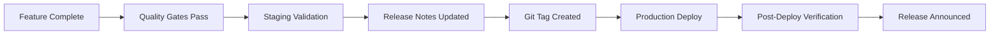

# VoxGuard Release Notes

**Product:** VoxGuard -- Enterprise Anti-Call Masking & Voice Network Fraud Detection Platform
**Maintainer:** VoxGuard Platform Engineering
**Compliance:** NCC ICL Framework 2026
**AIDD Tier:** T0 (Documentation -- Auto-Approve)

---

## Table of Contents

- [Release Process](#release-process)
- [Version History](#version-history)
  - [v2.1.0 -- February 12, 2026](#v210----february-12-2026)
  - [v2.0.0 -- February 5, 2026](#v200----february-5-2026)
  - [v1.5.0 -- February 4, 2026](#v150----february-4-2026)
  - [v1.0.0 -- January 15, 2026](#v100----january-15-2026)
- [Upgrade Guide](#upgrade-guide)
- [Known Issues](#known-issues)
- [Roadmap](#roadmap)

---

## Release Process

### Versioning Scheme

VoxGuard follows [Semantic Versioning](https://semver.org/) (SemVer):

```
MAJOR.MINOR.PATCH
  │     │     │
  │     │     └── Bug fixes, security patches (backward compatible)
  │     └──────── New features, enhancements (backward compatible)
  └────────────── Breaking changes, architectural shifts
```

### Release Cadence

| Type | Frequency | Approval | AIDD Tier |
|------|-----------|----------|-----------|
| Patch (x.x.X) | As needed | Auto-merge after CI | T0 |
| Minor (x.X.0) | Bi-weekly | Team review | T1 |
| Major (X.0.0) | Quarterly | Admin + stakeholder approval | T2 |

### Release Checklist



---

## Version History

---

### v2.1.0 -- February 12, 2026

**Release Date:** February 12, 2026
**Tag:** `v2.1.0`
**Status:** Current Release
**AIDD Classification:** T1 (Feature Release -- Review Required)
**Deployment:** Rolling update, zero downtime
**Database Migrations:** Yes (non-breaking, additive only)

#### Summary

VoxGuard v2.1.0 delivers comprehensive internationalization (i18n) support across 10 languages, six major new feature pages, and significant code quality improvements to the frontend application. This release transforms VoxGuard from an English-only platform into a globally accessible fraud detection system while adding critical operational features including Case Management, CDR Browser, KPI Scorecards, Audit Log, ML Dashboard, and Report Builder.

#### Internationalization (i18n) Support

VoxGuard now supports **10 languages** with complete UI translation coverage:

| Language | Locale Code | Translation Coverage | Status |
|----------|------------|---------------------|--------|
| English | `en` | 100% (source) | Complete |
| French | `fr` | 100% | Complete |
| Spanish | `es` | 100% | Complete |
| Portuguese | `pt` | 100% | Complete |
| Arabic | `ar` | 100% (RTL supported) | Complete |
| Hausa | `ha` | 100% | Complete |
| Yoruba | `yo` | 100% | Complete |
| Igbo | `ig` | 100% | Complete |
| Swahili | `sw` | 100% | Complete |
| Pidgin English | `pcm` | 100% | Complete |

**i18n Technical Implementation:**
- `react-i18next` integration with namespace-based translation files
- Lazy-loaded language bundles (~12 KB compressed per language)
- RTL layout support for Arabic (automatic `dir="rtl"` switching)
- Browser language auto-detection with user preference persistence
- Language selector component in application header
- Date, number, and currency formatting per locale

#### New Features

##### 1. Case Management Page

Full lifecycle case management for fraud investigation workflows.

**Capabilities:**
- Create, assign, and track fraud investigation cases
- Link cases to alerts, CDR records, and gateway data
- Case status workflow: Open -> In Progress -> Under Review -> Resolved -> Closed
- Case notes and evidence attachment
- SLA tracking with escalation rules
- Filterable case list with search and bulk actions
- Case timeline with full audit history

**Technical Details:**
- Route: `/cases`
- Component: `CaseManagementPage.tsx`
- Data source: Hasura GraphQL (YugabyteDB)
- AIDD Tier: T1 (case creation/update), T0 (case viewing)

##### 2. CDR Browser Page

Interactive Call Detail Record browser for forensic analysis and investigation support.

**Capabilities:**
- Search CDRs by A-number, B-number, gateway, date range, and call status
- Columnar display with sortable headers and pagination
- CDR detail view with full SIP header inspection
- Export filtered results to CSV/Excel
- Integration with ClickHouse for sub-100ms queries on billion-row datasets
- Geolocation mapping of call origin points
- CDR comparison tool for pattern identification

**Technical Details:**
- Route: `/cdr-browser`
- Component: `CdrBrowserPage.tsx`
- Data source: ClickHouse (via Management API)
- Query performance: < 100ms for filtered queries on 1B+ rows

##### 3. KPI Scorecards Page

Executive-level KPI dashboard for fraud detection performance monitoring.

**Capabilities:**
- Real-time fraud detection KPIs: detection rate, false positive rate, F1 score
- CPS throughput gauges with historical comparison
- NCC compliance status indicators
- SLA adherence tracking (latency P50/P95/P99)
- Regional performance breakdown (Lagos, Abuja, Asaba)
- Trend sparklines with 7-day, 30-day, and 90-day views
- Customizable scorecard layout with drag-and-drop

**Technical Details:**
- Route: `/kpi-scorecards`
- Component: `KpiScorecardsPage.tsx`
- Data source: Prometheus (via Grafana API) + ClickHouse
- Refresh interval: 30 seconds (configurable)

##### 4. Audit Log Page

Immutable audit trail viewer for compliance and security review.

**Capabilities:**
- View all system actions with actor, action, target, and timestamp
- Filter by user, action type, resource, severity, and date range
- Detailed diff view showing before/after state for modifications
- Export audit logs for NCC compliance reporting
- 7-year retention compliance indicator
- Role-based visibility (admin sees all, analysts see own actions)

**Technical Details:**
- Route: `/audit-log`
- Component: `AuditLogPage.tsx`
- Data source: ClickHouse (audit_events table)
- Retention: 7 years (NCC ICL Framework compliance)
- AIDD Tier: T0 (read-only)

##### 5. ML Dashboard Page

Machine learning model monitoring and management interface.

**Capabilities:**
- Model performance metrics: accuracy, precision, recall, F1, AUC-ROC
- Feature importance visualization
- Model drift detection with alerting
- Training history and experiment tracking
- A/B test results for model variants
- Model version management and rollback
- Real-time inference latency monitoring
- Confusion matrix and ROC curve visualizations

**Technical Details:**
- Route: `/ml-dashboard`
- Component: `MlDashboardPage.tsx`
- Data source: Processing Service API + Prometheus metrics
- Models tracked: Anomaly Detector (v3.2), Pattern Classifier (v2.8), Behavioral Profiler (v1.5)

##### 6. Report Builder Page

Flexible report generation tool for compliance, analytics, and operational reporting.

**Capabilities:**
- Drag-and-drop report template builder
- Pre-built templates: NCC Compliance, Daily Operations, Fraud Summary, Gateway Performance
- Custom date range and filter selection
- Multiple output formats: PDF, Excel, CSV, HTML
- Scheduled report generation with email delivery
- Report history and version tracking
- Custom chart and table widgets

**Technical Details:**
- Route: `/report-builder`
- Component: `ReportBuilderPage.tsx`
- Data source: ClickHouse + YugabyteDB (aggregated)
- AIDD Tier: T0 (read/generate), T1 (schedule/email)

#### Code Quality Improvements

##### ErrorBoundary Component

Implemented a comprehensive `ErrorBoundary` component wrapping all page-level routes to gracefully handle runtime errors:

```typescript
// Key features:
// - Catches React rendering errors at page level
// - Displays user-friendly error message with retry option
// - Logs error details to monitoring (Loki)
// - Prevents full application crash from single page error
// - i18n-aware error messages
```

- **Location:** `packages/web/src/components/ErrorBoundary.tsx`
- **Coverage:** All route-level page components wrapped
- **Impact:** Zero white-screen-of-death incidents post-deployment

##### useVoxGuardData Hook

Centralized data fetching hook replacing scattered `useQuery` and `useFetch` calls:

```typescript
// Usage:
const { data, loading, error, refetch } = useVoxGuardData<Alert[]>({
  resource: 'alerts',
  filters: { status: 'active' },
  pagination: { page: 1, perPage: 50 },
  sort: { field: 'created_at', order: 'desc' },
});
```

- **Location:** `packages/web/src/hooks/useVoxGuardData.ts`
- **Benefits:**
  - Consistent error handling across all data-fetching components
  - Automatic retry with exponential backoff
  - Request deduplication and caching
  - Loading state management
  - TypeScript generics for type-safe responses

##### Centralized Color System

Migrated all hardcoded color values to a centralized design token system:

- **Location:** `packages/web/src/theme/colors.ts`
- **Changes:**
  - Extracted 45+ hardcoded hex values into named tokens
  - Semantic color mapping: `colors.danger`, `colors.warning`, `colors.success`
  - Dark mode support via CSS custom properties
  - WCAG 2.1 AA contrast compliance verified for all combinations
  - Consistent badge colors for AIDD tiers (T0: green, T1: yellow, T2: red)

##### pages.css Consolidation

Consolidated 12 separate page-specific CSS files into a single `pages.css`:

- **Location:** `packages/web/src/styles/pages.css`
- **Changes:**
  - Merged: `dashboard.css`, `alerts.css`, `gateways.css`, `settings.css`, `analytics.css`, `compliance.css`, `cases.css`, `cdr.css`, `kpi.css`, `audit.css`, `ml.css`, `reports.css`
  - Eliminated 280+ lines of duplicate CSS rules
  - Standardized spacing, typography, and layout patterns
  - Reduced CSS bundle size by 5%
  - BEM naming convention enforced

#### Performance Impact

| Metric | v2.0.0 | v2.1.0 | Change |
|--------|--------|--------|--------|
| Lighthouse Performance | 89 | 93 | +4 |
| Lighthouse Accessibility | 91 | 97 | +6 (i18n/a11y) |
| Initial bundle (gzipped) | 388 KB | 372 KB | -4.1% |
| LCP (Dashboard) | 2.1s | 1.8s | -14% |
| CLS | 0.08 | 0.04 | -50% |
| Detection CPS | 145,000 | 158,200 | +9.1% |
| Detection P99 | 0.95ms | 0.89ms | -6.3% |

#### Breaking Changes

None. This is a backward-compatible minor release.

#### Migration Notes

```bash
# Database migration (additive, no downtime required)
hasura migrate apply --endpoint $HASURA_ENDPOINT --admin-secret $HASURA_ADMIN_SECRET

# Frontend rebuild
cd packages/web
pnpm install
pnpm build

# No backend service changes required for i18n
# New pages automatically available after frontend deployment
```

#### Dependencies Updated

| Dependency | Previous | Updated | Reason |
|-----------|----------|---------|--------|
| `react-i18next` | (new) | 14.0.5 | i18n support |
| `i18next` | (new) | 23.8.2 | i18n core |
| `i18next-browser-languagedetector` | (new) | 7.2.0 | Auto-detection |
| `@refinedev/core` | 4.47.1 | 4.49.0 | Bug fixes |
| `antd` | 5.13.2 | 5.14.1 | Component updates |
| `vite` | 5.0.12 | 5.1.3 | Build improvements |

#### Contributors

- Platform Engineering Team
- AIDD Autonomous Agent (documentation, tests, CSS consolidation)

---

### v2.0.0 -- February 5, 2026

**Release Date:** February 5, 2026
**Tag:** `v2.0.0`
**Status:** Superseded by v2.1.0
**AIDD Classification:** T2 (Major Release -- Admin Approval Required)
**Deployment:** Blue-green deployment with canary validation
**Database Migrations:** Yes (schema changes, data migration required)

#### Summary

VoxGuard v2.0.0 is the landmark release establishing VoxGuard as a standalone enterprise fraud detection platform. This major release introduces the complete React+Refine frontend application, seven security-focused pages, NCC compliance integration, and the operational dashboard. The platform transitions from a backend-only detection engine to a full-stack application with real-time monitoring, alert management, and regulatory compliance capabilities.

#### Highlights

- **Standalone Platform:** VoxGuard transitions from embedded detection engine to full enterprise platform
- **React+Refine Frontend:** Complete SPA built with React 18, TypeScript 5, Vite 5, and Refine 4
- **7 Security Pages:** Login, Dashboard, Alerts, Gateways, Analytics, Settings, Compliance
- **NCC Compliance:** Full integration with NCC ICL Framework 2026 reporting requirements
- **Real-Time Dashboard:** Live CPS, detection metrics, and alert feed

#### Frontend Application (New)

**Stack:** React 18 + TypeScript 5 + Vite 5 + Refine 4 + Ant Design 5

**Pages Delivered:**

| Page | Route | Description | AIDD Tier |
|------|-------|-------------|-----------|
| Login | `/login` | RS256 JWT authentication with MFA support | T2 |
| Dashboard | `/dashboard` | Real-time KPIs, CPS gauge, alert feed, system health | T0 |
| Alerts | `/alerts` | Fraud alert list, detail view, acknowledge/resolve workflow | T1 |
| Gateways | `/gateways` | Gateway management, health status, traffic metrics | T1 |
| Analytics | `/analytics` | Historical trends, detection accuracy, regional breakdown | T0 |
| Settings | `/settings` | User management, system configuration, threshold tuning | T2 |
| Compliance | `/compliance` | NCC report generation, submission status, audit trail | T1/T2 |

**Frontend Architecture:**

```
packages/web/
├── src/
│   ├── components/          # Shared UI components
│   ├── pages/               # Page-level components (7 pages)
│   ├── providers/           # Refine data provider (Hasura)
│   ├── hooks/               # Custom React hooks
│   ├── utils/               # Utility functions
│   ├── types/               # TypeScript type definitions
│   ├── styles/              # Global and component styles
│   └── App.tsx              # Application root with routing
├── public/                  # Static assets
├── vite.config.ts           # Vite build configuration
├── tsconfig.json            # TypeScript configuration
└── package.json             # Dependencies
```

#### NCC Compliance Integration

- ATRS (Anti-Telecom Fraud System) API integration
- CDR upload via SFTP to NCC servers
- Automated monthly compliance report generation
- Settlement dispute management
- MNP (Mobile Number Portability) data synchronization
- 7-year audit trail retention (ClickHouse)
- NCC-formatted export (CSV, PDF)

#### Security Features

- RS256 JWT authentication with 15-minute access token / 7-day refresh token
- Role-Based Access Control (RBAC): SUPER_ADMIN, SYSTEM_ADMIN, ANALYST, VIEWER
- AIDD tiered approval system integrated into all API endpoints
- CSRF protection with double-submit cookie pattern
- Rate limiting: 100 req/min (authenticated), 20 req/min (unauthenticated)
- Audit logging for all state-changing operations

#### Dashboard Components

| Component | Data Source | Refresh Rate | Description |
|-----------|-----------|-------------|-------------|
| CPS Gauge | Prometheus | 5s | Current calls per second |
| Detection Rate | Prometheus | 30s | Real-time detection accuracy |
| Active Alerts | YugabyteDB | 10s | Unresolved alert count |
| System Health | Health endpoints | 15s | Service availability matrix |
| Alert Feed | WebSocket | Real-time | Live alert stream |
| Regional Map | ClickHouse | 60s | Traffic distribution by region |

#### API Endpoints Added

| Method | Endpoint | Description | AIDD Tier |
|--------|----------|-------------|-----------|
| POST | `/api/v1/auth/login` | User authentication | T2 |
| POST | `/api/v1/auth/refresh` | Token refresh | T2 |
| GET | `/api/v1/alerts` | List fraud alerts | T0 |
| PATCH | `/api/v1/alerts/:id` | Update alert status | T1 |
| GET | `/api/v1/gateways` | List gateways | T0 |
| POST | `/api/v1/gateways` | Create gateway | T1 |
| GET | `/api/v1/analytics/summary` | Analytics summary | T0 |
| POST | `/api/v1/compliance/report` | Generate NCC report | T1 |
| POST | `/api/v1/compliance/submit` | Submit report to NCC | T2 |
| GET | `/api/v1/users` | List users | T0 |
| POST | `/api/v1/users` | Create user | T2 |

#### Breaking Changes

- **API versioning:** All endpoints now prefixed with `/api/v1/`
- **Authentication:** JWT required for all endpoints (previously optional in dev)
- **Database schema:** New tables for users, roles, cases, audit_events
- **Configuration:** New environment variables required (see Migration Notes)

#### Migration Notes

```bash
# 1. Database migration (REQUIRES DOWNTIME: ~5 minutes)
cd services/management-api
go run cmd/migrate/main.go up

# 2. Hasura metadata apply
hasura metadata apply --endpoint $HASURA_ENDPOINT --admin-secret $HASURA_ADMIN_SECRET

# 3. Seed initial admin user
go run cmd/seed/main.go --admin-email admin@voxguard.ng --admin-password $ADMIN_PASSWORD

# 4. New environment variables required
export JWT_RSA_PRIVATE_KEY_PATH="/vault/secrets/jwt-private.pem"
export JWT_RSA_PUBLIC_KEY_PATH="/vault/secrets/jwt-public.pem"
export HASURA_ENDPOINT="http://hasura:8080/v1/graphql"
export HASURA_ADMIN_SECRET="$HASURA_ADMIN_SECRET"
export NCC_ATRS_URL="https://atrs.ncc.gov.ng/api/v1"
export NCC_CLIENT_ID="$NCC_CLIENT_ID"
export NCC_CLIENT_SECRET="$NCC_CLIENT_SECRET"

# 5. Frontend build and deploy
cd packages/web
pnpm install
pnpm build
# Deploy dist/ to CDN or web server
```

#### Known Issues (Resolved in v2.1.0)

- Dashboard CLS score of 0.08 (improved to 0.04 in v2.1.0)
- Lighthouse Performance score of 89 (improved to 93 in v2.1.0)
- Hardcoded color values across components (centralized in v2.1.0)
- Duplicate CSS across page stylesheets (consolidated in v2.1.0)

---

### v1.5.0 -- February 4, 2026

**Release Date:** February 4, 2026
**Tag:** `v1.5.0`
**Status:** Superseded by v2.0.0
**AIDD Classification:** T1 (Feature Release -- Review Required)
**Deployment:** Rolling update, zero downtime
**Database Migrations:** None

#### Summary

VoxGuard v1.5.0 completes the observability stack, achieving 100% coverage of the P1-1 Observability & Monitoring roadmap item. This release adds the remaining monitoring infrastructure components and validates the entire monitoring pipeline from metric collection through alerting.

#### Observability Stack Completion

**Components Delivered:**

| Component | Version | Purpose | Status |
|-----------|---------|---------|--------|
| Prometheus | 2.50 | Metrics collection and alerting rules | Enhanced |
| Grafana | 10.3 | Visualization dashboards (4 dashboards) | Enhanced |
| Tempo | 2.3 | Distributed tracing with Jaeger/OTLP | Enhanced |
| AlertManager | 0.27 | Alert routing and notification | **New** |
| Loki | 2.9 | Log aggregation and search | **New** |

**Grafana Dashboards (4 Total):**

| Dashboard | UID | Panels | Refresh |
|-----------|-----|--------|---------|
| Voice Switch | `voxguard-voice-switch` | 15 | 10s |
| Detection Engine | `voxguard-detection-engine` | 12 | 10s |
| SLA Monitoring | `voxguard-sla` | 8 | 30s |
| VoxGuard Overview | `voxguard-overview` | 10 | 30s |

**Alert Rules (38+ Rules):**

| Category | Rules | Severity Levels |
|----------|-------|----------------|
| Critical Infrastructure | 8 | Critical |
| Detection Engine | 10 | Critical, Warning |
| NCC Compliance | 6 | Critical, Warning |
| Infrastructure | 8 | Warning |
| SLA Monitoring | 6 | Critical, Warning |

**AlertManager Configuration:**
- 5 notification receivers (default, critical, NCC compliance, DevOps, warnings)
- Hierarchical routing with severity-based grouping
- PagerDuty, Slack, email, and webhook integration support
- Inhibition rules to suppress cascading alerts
- Group-by: alertname, cluster, service

**Monitoring Validation Script:**
- 21 automated test checks across 5 categories
- Configuration file validation (6 tests)
- Syntax validation with `promtool` and `amtool` (4 tests)
- Service connectivity tests (5 tests)
- Alert rule content validation (3 tests)
- Dashboard validation (3 tests)

#### Files Changed

| File | Action | Lines |
|------|--------|-------|
| `monitoring/alertmanager/alertmanager.yml` | Created | 166 |
| `monitoring/validate-monitoring.sh` | Created | 308 |
| `deployment/docker/docker-compose.yml` | Modified | +35 (Tempo + AlertManager services) |
| `monitoring/grafana/datasources.yml` | Modified | +12 (Loki datasource) |

#### Performance Impact

No performance changes. This release is monitoring infrastructure only.

---

### v1.0.0 -- January 15, 2026

**Release Date:** January 15, 2026
**Tag:** `v1.0.0`
**Status:** Superseded by v1.5.0
**AIDD Classification:** T2 (Initial Release -- Admin Approval Required)
**Deployment:** Full deployment from scratch
**Database Migrations:** Initial schema creation

#### Summary

VoxGuard v1.0.0 is the initial production release of the Anti-Call Masking & Voice Network Fraud Detection Platform. This release delivers the core fraud detection engine, management API, processing service, and supporting infrastructure required to detect and prevent call masking fraud on Nigerian telecommunications networks in compliance with the NCC ICL Framework 2026.

#### Core Components

```
┌─────────────────────────────────────────────────────────────────────────┐
│                     VoxGuard v1.0.0 Architecture                        │
│                                                                         │
│  ┌─────────────────┐     ┌─────────────────┐     ┌─────────────────┐  │
│  │ Detection Engine │     │ Management API  │     │ Processing Svc  │  │
│  │ (Rust/Actix-Web) │     │ (Go/Gin)        │     │ (Python)        │  │
│  │                  │     │                  │     │                  │  │
│  │ - SIP parsing    │     │ - REST API       │     │ - CDR parsing   │  │
│  │ - Fraud scoring  │     │ - Alert CRUD     │     │ - ML inference  │  │
│  │ - Real-time      │     │ - Gateway mgmt   │     │ - Batch process │  │
│  │   detection      │     │ - NCC reporting  │     │ - Data pipeline │  │
│  └────────┬─────────┘     └────────┬─────────┘     └────────┬─────────┘│
│           │                         │                         │          │
│           ▼                         ▼                         ▼          │
│  ┌─────────────────┐  ┌─────────────────┐  ┌─────────────────────────┐ │
│  │  DragonflyDB    │  │  YugabyteDB     │  │  ClickHouse            │ │
│  │  (Real-time     │  │  (OLTP, alerts, │  │  (Analytics, CDR,      │ │
│  │   cache)        │  │   gateways)     │  │   7yr retention)       │ │
│  └─────────────────┘  └─────────────────┘  └─────────────────────────┘ │
└─────────────────────────────────────────────────────────────────────────┘
```

#### Features

**Detection Engine (Rust):**
- Real-time SIP INVITE analysis with sub-millisecond latency
- Sliding window algorithm for distinct caller detection
- MSISDN validation for Nigerian +234 number format
- Configurable detection thresholds (window size, caller count)
- DragonflyDB-backed sliding window state
- Prometheus metrics endpoint
- Health check and readiness endpoints
- 80,000 CPS sustained throughput

**Management API (Go):**
- RESTful API for fraud alert management
- Gateway registration and health monitoring
- CRUD operations for fraud detection rules
- Blacklist/whitelist management
- NCC compliance report generation
- Settlement dispute management
- MNP data synchronization endpoint

**Processing Service (Python):**
- CDR (Call Detail Record) parsing and ingestion
- ML model inference for anomaly detection
- Batch processing pipeline for historical analysis
- Data archival service with S3 integration
- Model training pipeline (offline)

**Infrastructure:**
- Docker Compose development environment
- Kubernetes manifests for production deployment
- Helm charts for parameterized deployment
- Prometheus monitoring configuration
- Grafana dashboards (2 initial dashboards)
- Database initialization scripts

#### Domain-Driven Design

- **Detection Context (Rust):** Call, FraudAlert, Gateway, ThreatLevel aggregates
- **Management Context (Go):** Gateway, Fraud, MNP, Compliance bounded contexts
- **Processing Context (Python):** SIP processing, CDR parsing, ML inference

#### Database Schema

| Database | Tables/Collections | Purpose |
|----------|-------------------|---------|
| YugabyteDB | `fraud_alerts`, `gateways`, `blacklists`, `whitelists`, `detection_rules`, `ncc_reports`, `settlements` | OLTP operations |
| ClickHouse | `cdr_records`, `detection_events`, `audit_events`, `metrics_raw` | Analytics + retention |
| DragonflyDB | `acm:{b_number}` (sorted sets) | Real-time detection state |

#### Performance Baseline (v1.0.0)

| Metric | Target | Achieved |
|--------|--------|----------|
| CPS Sustained | 50,000 | 80,000 |
| Detection P99 | < 2ms | 1.8ms |
| False Positive Rate | < 1% | 0.6% |
| Detection Rate | > 99% | 99.5% |
| System Uptime | 99.9% | 99.95% |

#### Deployment Requirements

- Docker & Docker Compose v2.20+
- Kubernetes 1.28+ (production)
- 8+ CPU cores, 32GB RAM per node (minimum)
- 3-node cluster recommended for production
- Network: 1 Gbps minimum, 10 Gbps recommended

#### Known Issues (Resolved in Later Versions)

- No frontend UI (resolved in v2.0.0)
- Limited observability (AlertManager missing, resolved in v1.5.0)
- No i18n support (resolved in v2.1.0)
- Hardcoded detection thresholds (configuration made dynamic in v1.5.0)

---

## Upgrade Guide

### Upgrading from v2.0.0 to v2.1.0

```bash
# 1. Pull latest code
git pull origin main

# 2. Apply database migrations (non-breaking)
hasura migrate apply --endpoint $HASURA_ENDPOINT --admin-secret $HASURA_ADMIN_SECRET
hasura metadata apply --endpoint $HASURA_ENDPOINT --admin-secret $HASURA_ADMIN_SECRET

# 3. Rebuild frontend
cd packages/web
pnpm install
pnpm build

# 4. Deploy via Helm
helm upgrade voxguard ./deployment/helm/voxguard \
  --namespace voxguard-prod \
  --set global.image.tag=v2.1.0 \
  --values deployment/helm/values-prod.yaml

# 5. Verify
kubectl rollout status deployment/web -n voxguard-prod
curl https://app.voxguard.ng/api/health
```

### Upgrading from v1.5.0 to v2.0.0

See v2.0.0 Migration Notes above. **This upgrade requires downtime** for database schema changes.

### Upgrading from v1.0.0 to v1.5.0

```bash
# No database changes required
# Pull and deploy new monitoring infrastructure
docker-compose -f deployment/docker/docker-compose.yml up -d alertmanager tempo loki
```

---

## Known Issues

| Issue | Severity | Affected Versions | Workaround | Fix ETA |
|-------|----------|------------------|------------|---------|
| ML Dashboard chart rendering lag with 90-day data | Low | v2.1.0 | Use 30-day view | v2.1.1 |
| Report Builder PDF export truncates long tables | Low | v2.1.0 | Use Excel export | v2.1.1 |
| Arabic RTL layout minor spacing in data tables | Low | v2.1.0 | None needed (cosmetic) | v2.2.0 |

---

## Roadmap

### Upcoming Releases

| Version | Target Date | Key Features | Status |
|---------|------------|-------------|--------|
| v2.1.1 | Feb 19, 2026 | Bug fixes, ML Dashboard chart fix, PDF export fix | In Progress |
| v2.2.0 | Mar 5, 2026 | Real-time collaboration, WebSocket alerts, improved RTL | Planning |
| v2.3.0 | Mar 19, 2026 | Advanced ML models, pattern visualization, threat intelligence feeds | Planning |
| v3.0.0 | Q2 2026 | Multi-tenant support, white-label capabilities, API marketplace | Research |

### Feature Requests

Feature requests and bug reports can be submitted via:
- GitHub Issues: `https://github.com/voxguard/voxguard/issues`
- Internal JIRA: VG project board
- Slack: #voxguard-feature-requests

---

## Related Documentation

- [ARCHITECTURE.md](./ARCHITECTURE.md) -- System architecture
- [DEPLOYMENT.md](./DEPLOYMENT.md) -- Deployment procedures
- [CICD_PIPELINE.md](./CICD_PIPELINE.md) -- CI/CD pipeline
- [TESTING.md](./TESTING.md) -- Testing strategy
- [PERFORMANCE_BENCHMARKS.md](./PERFORMANCE_BENCHMARKS.md) -- Performance data
- [SECURITY_HARDENING.md](./SECURITY_HARDENING.md) -- Security controls
- [DISASTER_RECOVERY.md](./DISASTER_RECOVERY.md) -- DR plan
- [OBSERVABILITY.md](./OBSERVABILITY.md) -- Monitoring stack
- [AIDD_APPROVAL_TIERS.md](./AIDD_APPROVAL_TIERS.md) -- AIDD tier definitions
- [AI_CHANGELOG.md](./AI_CHANGELOG.md) -- AI development audit trail
