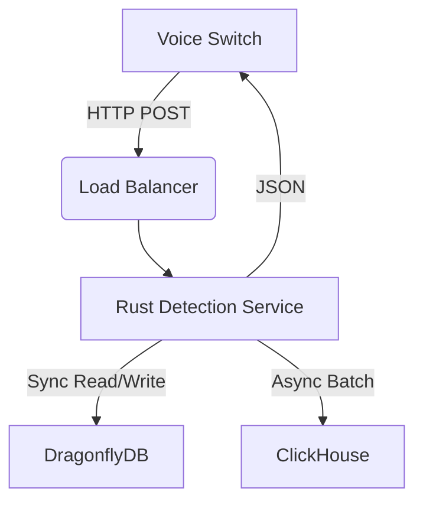

# Architecture Specification
## Anti-Call Masking System

### 1. High-Level Overview
The system follows a **Stream Processing Architecture** optimized for zero-latency decision making. It decouples the "Decision Path" (Hot Path) from the "Storage Path" (Cold Path).

### 2. Components

#### 2.1 Detection Service (Rust)
-   **Role**: Ingests events, executes logic, returns verdict.
-   **Stack**: Rust, Actix-Web, Tokio.
-   **Scaling**: Stateless. Horizontally scalable via Kubernetes HPA.

#### 2.2 DragonflyDB (Hot Store)
-   **Role**: Sentinel for the "Sliding Window" state.
-   **Data Structure**: Redis Set with TTL (Time-To-Live).
-   **Performance**: Multi-threaded, shared-nothing architecture. Capable of millions of OPS.

#### 2.3 ClickHouse (Cold Store)
-   **Role**: System of Record for all calls and alerts.
-   **Optimization**: Columnar storage for rapid OLAP (Online Analytical Processing) queries.
-   **Retention**: Configurable (default 1 year).

### 3. Data Flow
1.  **Ingest**: Voice Switch sends `POST /event`.
2.  **Window Update**: Rust service adds `a_number` to a Set key `window:{b_number}` in DragonflyDB with 5s expiry.
3.  **Check**: Rust service counts members of the Set.
    -   If `count > threshold`: Return **ALERT**.
    -   Else: Return **OK**.
4.  **Log**: Rust service pushes event to an in-memory buffer, which is flushed to ClickHouse every 1s or 1000 events.

### 4. Security Architecture
-   **Network**: All services run in a private VPC/K8s Namespace.
-   **Ingress**: Only port 80 (HTTP) is exposed via Ingress Controller to the Voice Switch.
-   **Databases**: Not exposed publicly.
