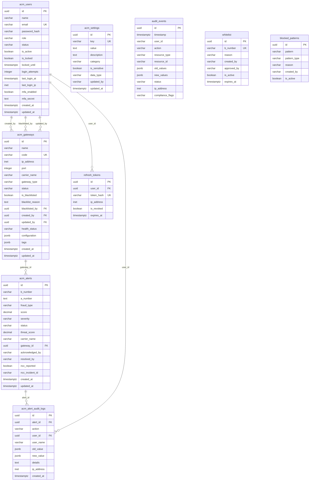
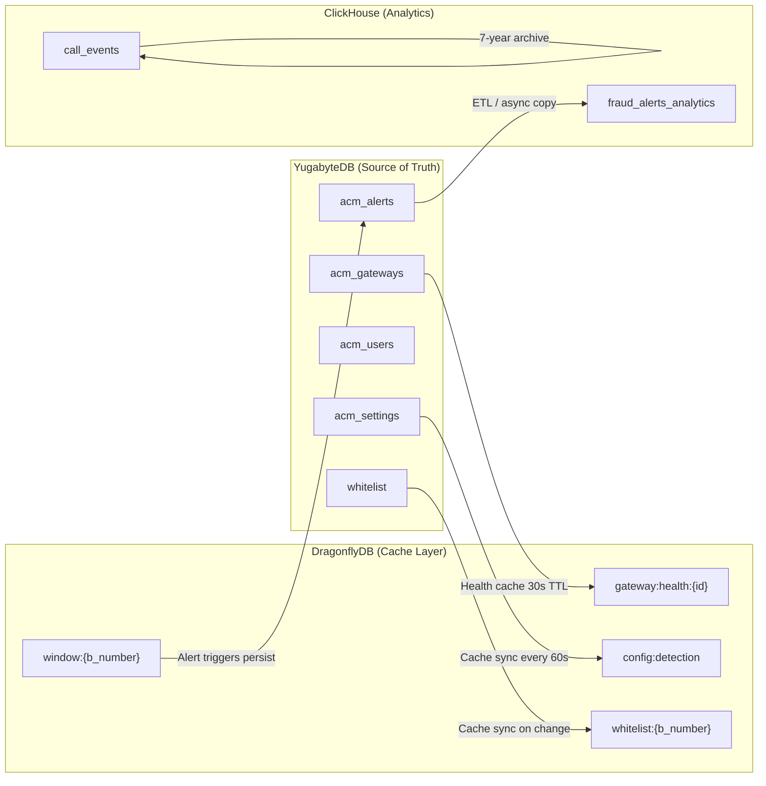

# Database Schema & Data Dictionary

## VoxGuard -- Anti-Call Masking & Voice Network Fraud Detection Platform

**Version:** 1.0
**Date:** February 2026
**Status:** Production
**Classification:** Technical -- Internal
**AIDD Compliance:** Tier 0 (Documentation)

---

## Table of Contents

1. [Overview](#1-overview)
2. [Database Architecture](#2-database-architecture)
3. [YugabyteDB Schema (ACID Store)](#3-yugabytedb-schema-acid-store)
4. [DragonflyDB Keys (Hot Store)](#4-dragonflydb-keys-hot-store)
5. [ClickHouse Tables (OLAP Cold Store)](#5-clickhouse-tables-olap-cold-store)
6. [Entity-Relationship Diagrams](#6-entity-relationship-diagrams)
7. [Indexing Strategy](#7-indexing-strategy)
8. [Partitioning Strategy](#8-partitioning-strategy)
9. [Data Lifecycle & Retention](#9-data-lifecycle--retention)
10. [Hasura GraphQL Mapping](#10-hasura-graphql-mapping)
11. [Migration Strategy](#11-migration-strategy)

---

## 1. Overview

VoxGuard employs a polyglot persistence architecture with three database technologies, each selected for a specific workload profile:

| Database | Role | Workload | Access Pattern |
|---|---|---|---|
| **YugabyteDB** | ACID Store | Transactional CRUD | Read/write via SQL (PostgreSQL wire protocol) |
| **DragonflyDB** | Hot Store | Real-time detection state | Read/write via Redis protocol |
| **ClickHouse** | Cold Store | OLAP analytics, CDR archive | Write-heavy ingestion, read-heavy aggregation |

All three are accessed by the Detection Engine (Rust). The Management API (Go) and Hasura access only YugabyteDB. The ML Pipeline (Python) accesses ClickHouse and DragonflyDB.

---

## 2. Database Architecture

```mermaid
flowchart TB
    subgraph Clients
        DE[Detection Engine<br>Rust]
        MA[Management API<br>Go]
        ML[ML Pipeline<br>Python]
        Hasura[Hasura GraphQL]
        Archival[Data Archival Service<br>Python]
    end

    subgraph YugabyteDB["YugabyteDB (ACID Store)"]
        YB_Alerts[acm_alerts]
        YB_Gateways[acm_gateways]
        YB_Users[acm_users]
        YB_Settings[acm_settings]
        YB_AuditLogs[acm_alert_audit_logs]
        YB_Whitelist[whitelist]
        YB_Blocked[blocked_patterns]
        YB_AuditEvents[audit_events]
        YB_RefreshTokens[refresh_tokens]
    end

    subgraph DragonflyDB["DragonflyDB (Hot Store)"]
        DF_Windows[Sliding Window Sets]
        DF_Whitelist[Whitelist Cache]
        DF_RateLimit[Rate Limiters]
        DF_Config[Config Cache]
        DF_Features[Feature Store]
        DF_Sessions[Session Cache]
        DF_Flags[Feature Flags]
        DF_Circuit[Circuit Breakers]
    end

    subgraph ClickHouse["ClickHouse (Cold Store)"]
        CH_CDR[CDR Archive]
        CH_Alerts[Fraud Alerts Analytics]
        CH_Daily[Daily Stats MV]
        CH_Hourly[Hourly Traffic MV]
        CH_Patterns[Fraud Patterns]
    end

    DE --> YB_Alerts
    DE --> DF_Windows
    DE --> CH_CDR
    MA --> YB_Alerts
    MA --> YB_Gateways
    MA --> YB_Users
    MA --> YB_Settings
    MA --> YB_AuditLogs
    ML --> DF_Features
    ML --> CH_CDR
    Hasura --> YugabyteDB
    Archival --> YugabyteDB
    Archival --> ClickHouse
```



---

## 3. YugabyteDB Schema (ACID Store)

### 3.1 acm_alerts

**Description:** Primary table for fraud detection alerts. Created when the Detection Engine identifies CLI spoofing / multicall masking patterns. Managed through the dashboard via Hasura GraphQL subscriptions.

**DDL:**

```sql
CREATE TABLE acm_alerts (
    id              UUID PRIMARY KEY DEFAULT gen_random_uuid(),
    b_number        VARCHAR(20) NOT NULL,
    a_number        TEXT NOT NULL,                          -- JSON array of A-numbers or primary A-number
    fraud_type      VARCHAR(50) NOT NULL DEFAULT 'multicall_masking',
    score           DECIMAL(5,4),                           -- ML fraud score (0.0000 - 1.0000)
    severity        VARCHAR(20) NOT NULL DEFAULT 'medium',
    status          VARCHAR(30) NOT NULL DEFAULT 'new',
    threat_score    DECIMAL(5,2),                           -- Composite threat score (0.00 - 100.00)
    detection_type  VARCHAR(50),                            -- Detection method used
    carrier_name    VARCHAR(100),
    gateway_id      UUID REFERENCES acm_gateways(id),
    notes           TEXT,
    assigned_to     VARCHAR(255),
    acknowledged_by VARCHAR(255),
    acknowledged_at TIMESTAMPTZ,
    resolved_by     VARCHAR(255),
    resolved_at     TIMESTAMPTZ,
    ncc_reported    BOOLEAN DEFAULT FALSE,
    ncc_incident_id VARCHAR(64),
    created_at      TIMESTAMPTZ NOT NULL DEFAULT NOW(),
    updated_at      TIMESTAMPTZ NOT NULL DEFAULT NOW()
);
```

**Field-Level Data Dictionary:**

| Column | Type | Nullable | Default | Constraints | Description |
|---|---|---|---|---|---|
| `id` | UUID | No | `gen_random_uuid()` | PRIMARY KEY | Unique alert identifier |
| `b_number` | VARCHAR(20) | No | -- | NOT NULL | Destination number (victim) in E.164 format (+234...) |
| `a_number` | TEXT | No | -- | NOT NULL | Source number(s). JSON array of distinct A-numbers or primary caller |
| `fraud_type` | VARCHAR(50) | No | `'multicall_masking'` | NOT NULL | Type of fraud: `multicall_masking`, `wangiri`, `irsf`, `cli_spoofing` |
| `score` | DECIMAL(5,4) | Yes | NULL | 0.0000 - 1.0000 | ML model fraud probability score |
| `severity` | VARCHAR(20) | No | `'medium'` | NOT NULL | Alert severity: `low`, `medium`, `high`, `critical` |
| `status` | VARCHAR(30) | No | `'new'` | NOT NULL | Lifecycle status: `new`, `acknowledged`, `investigating`, `resolved`, `false_positive` |
| `threat_score` | DECIMAL(5,2) | Yes | NULL | 0.00 - 100.00 | Composite threat score combining ML score and heuristics |
| `detection_type` | VARCHAR(50) | Yes | NULL | -- | Detection method: `threshold`, `ml_model`, `hybrid`, `manual` |
| `carrier_name` | VARCHAR(100) | Yes | NULL | -- | Originating carrier name |
| `gateway_id` | UUID | Yes | NULL | FK -> acm_gateways(id) | Source gateway that originated the fraudulent traffic |
| `notes` | TEXT | Yes | NULL | -- | Analyst investigation notes |
| `assigned_to` | VARCHAR(255) | Yes | NULL | -- | User ID of assigned analyst |
| `acknowledged_by` | VARCHAR(255) | Yes | NULL | -- | User ID who acknowledged the alert |
| `acknowledged_at` | TIMESTAMPTZ | Yes | NULL | -- | Timestamp of acknowledgement |
| `resolved_by` | VARCHAR(255) | Yes | NULL | -- | User ID who resolved the alert |
| `resolved_at` | TIMESTAMPTZ | Yes | NULL | -- | Timestamp of resolution |
| `ncc_reported` | BOOLEAN | No | `FALSE` | -- | Whether alert has been reported to NCC |
| `ncc_incident_id` | VARCHAR(64) | Yes | NULL | -- | NCC ATRS incident reference number |
| `created_at` | TIMESTAMPTZ | No | `NOW()` | NOT NULL | Alert creation timestamp |
| `updated_at` | TIMESTAMPTZ | No | `NOW()` | NOT NULL | Last modification timestamp |

---

### 3.2 acm_gateways

**Description:** Voice gateway/switch registry. Tracks all Class 4 and Class 5 switches monitored by VoxGuard. Includes health monitoring, NCC compliance status, and blacklisting capabilities.

**DDL:**

```sql
CREATE TABLE acm_gateways (
    id                       UUID PRIMARY KEY DEFAULT gen_random_uuid(),
    name                     VARCHAR(100) NOT NULL,
    code                     VARCHAR(20) UNIQUE,
    ip_address               INET NOT NULL,
    port                     INTEGER DEFAULT 5060,
    protocol                 VARCHAR(10) DEFAULT 'SIP',
    carrier_name             VARCHAR(100) NOT NULL,
    carrier_type             VARCHAR(50),
    country_code             VARCHAR(5) DEFAULT '+234',
    region                   VARCHAR(50),
    gateway_type             VARCHAR(30) NOT NULL,
    direction                VARCHAR(20) DEFAULT 'both',
    is_monitored             BOOLEAN DEFAULT TRUE,
    fraud_threshold          INTEGER DEFAULT 5,
    max_concurrent_calls     INTEGER DEFAULT 1000,
    max_calls_per_second     INTEGER DEFAULT 100,
    status                   VARCHAR(20) NOT NULL DEFAULT 'active',
    is_blacklisted           BOOLEAN DEFAULT FALSE,
    blacklist_reason         TEXT,
    blacklisted_at           TIMESTAMPTZ,
    blacklisted_by           UUID REFERENCES acm_users(id),
    health_status            VARCHAR(20) DEFAULT 'unknown',
    last_heartbeat           TIMESTAMPTZ,
    total_calls_today        BIGINT DEFAULT 0,
    failed_calls_today       BIGINT DEFAULT 0,
    fraud_alerts_today       INTEGER DEFAULT 0,
    avg_call_duration_seconds DECIMAL(10,2) DEFAULT 0,
    current_concurrent_calls INTEGER DEFAULT 0,
    peak_concurrent_calls    INTEGER DEFAULT 0,
    current_cps              INTEGER DEFAULT 0,
    peak_cps                 INTEGER DEFAULT 0,
    ncc_license_number       VARCHAR(50),
    license_expiry_date      DATE,
    is_ncc_compliant         BOOLEAN DEFAULT FALSE,
    technical_contact_name   VARCHAR(100),
    technical_contact_email  VARCHAR(255),
    technical_contact_phone  VARCHAR(20),
    description              TEXT,
    configuration            JSONB DEFAULT '{}',
    tags                     JSONB DEFAULT '[]',
    created_by               UUID REFERENCES acm_users(id),
    updated_by               UUID REFERENCES acm_users(id),
    created_at               TIMESTAMPTZ NOT NULL DEFAULT NOW(),
    updated_at               TIMESTAMPTZ NOT NULL DEFAULT NOW()
);
```

**Field-Level Data Dictionary:**

| Column | Type | Nullable | Default | Description |
|---|---|---|---|---|
| `id` | UUID | No | `gen_random_uuid()` | Unique gateway identifier |
| `name` | VARCHAR(100) | No | -- | Human-readable gateway name |
| `code` | VARCHAR(20) | Yes | NULL | Unique short code for gateway (e.g., `GW-LAG-01`) |
| `ip_address` | INET | No | -- | Gateway IP address (IPv4 or IPv6) |
| `port` | INTEGER | Yes | `5060` | SIP signaling port |
| `protocol` | VARCHAR(10) | Yes | `'SIP'` | Protocol: `SIP`, `SIP-TLS`, `H.323` |
| `carrier_name` | VARCHAR(100) | No | -- | Operating carrier/operator name |
| `carrier_type` | VARCHAR(50) | Yes | NULL | Carrier classification: `mobile`, `fixed`, `voip`, `international` |
| `country_code` | VARCHAR(5) | Yes | `'+234'` | Country dialing code |
| `region` | VARCHAR(50) | Yes | NULL | Geographic region: `lagos`, `abuja`, `asaba`, etc. |
| `gateway_type` | VARCHAR(30) | No | -- | Type: `international`, `national`, `regional`, `sbc` |
| `direction` | VARCHAR(20) | Yes | `'both'` | Traffic direction: `inbound`, `outbound`, `both` |
| `is_monitored` | BOOLEAN | Yes | `TRUE` | Whether fraud detection is active for this gateway |
| `fraud_threshold` | INTEGER | Yes | `5` | Custom fraud detection threshold (distinct A-numbers) |
| `max_concurrent_calls` | INTEGER | Yes | `1000` | Maximum concurrent call limit |
| `max_calls_per_second` | INTEGER | Yes | `100` | Maximum CPS limit |
| `status` | VARCHAR(20) | No | `'active'` | Operational status: `active`, `inactive`, `maintenance`, `decommissioned` |
| `is_blacklisted` | BOOLEAN | Yes | `FALSE` | Whether gateway is blacklisted (all traffic blocked) |
| `blacklist_reason` | TEXT | Yes | NULL | Reason for blacklisting |
| `blacklisted_at` | TIMESTAMPTZ | Yes | NULL | When the gateway was blacklisted |
| `blacklisted_by` | UUID | Yes | NULL | FK to acm_users -- who blacklisted |
| `health_status` | VARCHAR(20) | Yes | `'unknown'` | Current health: `healthy`, `degraded`, `down`, `unknown` |
| `last_heartbeat` | TIMESTAMPTZ | Yes | NULL | Last health check response time |
| `total_calls_today` | BIGINT | Yes | `0` | Running total of calls processed today |
| `failed_calls_today` | BIGINT | Yes | `0` | Running total of failed calls today |
| `fraud_alerts_today` | INTEGER | Yes | `0` | Running count of fraud alerts today |
| `avg_call_duration_seconds` | DECIMAL(10,2) | Yes | `0` | Average call duration today |
| `current_concurrent_calls` | INTEGER | Yes | `0` | Current active concurrent calls |
| `peak_concurrent_calls` | INTEGER | Yes | `0` | Peak concurrent calls today |
| `current_cps` | INTEGER | Yes | `0` | Current calls per second |
| `peak_cps` | INTEGER | Yes | `0` | Peak CPS today |
| `ncc_license_number` | VARCHAR(50) | Yes | NULL | NCC license/registration number |
| `license_expiry_date` | DATE | Yes | NULL | NCC license expiry date |
| `is_ncc_compliant` | BOOLEAN | Yes | `FALSE` | Whether gateway meets NCC compliance requirements |
| `technical_contact_name` | VARCHAR(100) | Yes | NULL | Technical contact person name |
| `technical_contact_email` | VARCHAR(255) | Yes | NULL | Technical contact email address |
| `technical_contact_phone` | VARCHAR(20) | Yes | NULL | Technical contact phone number |
| `description` | TEXT | Yes | NULL | Free-text description of the gateway |
| `configuration` | JSONB | Yes | `'{}'` | Gateway-specific configuration parameters |
| `tags` | JSONB | Yes | `'[]'` | Array of tags for categorization |
| `created_by` | UUID | Yes | NULL | FK to acm_users -- creator |
| `updated_by` | UUID | Yes | NULL | FK to acm_users -- last updater |
| `created_at` | TIMESTAMPTZ | No | `NOW()` | Record creation timestamp |
| `updated_at` | TIMESTAMPTZ | No | `NOW()` | Last modification timestamp |

---

### 3.3 acm_users

**Description:** Platform user accounts for authentication, authorization, and audit tracking.

**DDL:**

```sql
CREATE TABLE acm_users (
    id              UUID PRIMARY KEY DEFAULT gen_random_uuid(),
    name            VARCHAR(100) NOT NULL,
    email           VARCHAR(255) NOT NULL UNIQUE,
    password_hash   VARCHAR(255) NOT NULL,
    role            VARCHAR(30) NOT NULL DEFAULT 'viewer',
    status          VARCHAR(20) NOT NULL DEFAULT 'active',
    is_active       BOOLEAN DEFAULT TRUE,
    is_locked       BOOLEAN DEFAULT FALSE,
    locked_until    TIMESTAMPTZ,
    login_attempts  INTEGER DEFAULT 0,
    last_login_at   TIMESTAMPTZ,
    last_login_ip   INET,
    mfa_enabled     BOOLEAN DEFAULT FALSE,
    mfa_secret      TEXT,
    avatar_url      VARCHAR(500),
    created_at      TIMESTAMPTZ NOT NULL DEFAULT NOW(),
    updated_at      TIMESTAMPTZ NOT NULL DEFAULT NOW()
);
```

**Field-Level Data Dictionary:**

| Column | Type | Nullable | Default | Description |
|---|---|---|---|---|
| `id` | UUID | No | `gen_random_uuid()` | Unique user identifier |
| `name` | VARCHAR(100) | No | -- | Full display name |
| `email` | VARCHAR(255) | No | -- | Email address (unique, used for login) |
| `password_hash` | VARCHAR(255) | No | -- | bcrypt hash (cost 12) of password |
| `role` | VARCHAR(30) | No | `'viewer'` | Primary role: `admin`, `analyst`, `developer`, `viewer` |
| `status` | VARCHAR(20) | No | `'active'` | Account status: `active`, `inactive`, `suspended` |
| `is_active` | BOOLEAN | Yes | `TRUE` | Whether account is enabled |
| `is_locked` | BOOLEAN | Yes | `FALSE` | Whether account is locked due to failed logins |
| `locked_until` | TIMESTAMPTZ | Yes | NULL | Lockout expiry (NULL if not locked) |
| `login_attempts` | INTEGER | Yes | `0` | Consecutive failed login attempts (resets on success) |
| `last_login_at` | TIMESTAMPTZ | Yes | NULL | Most recent successful login timestamp |
| `last_login_ip` | INET | Yes | NULL | IP address of most recent login |
| `mfa_enabled` | BOOLEAN | Yes | `FALSE` | Whether TOTP MFA is enabled |
| `mfa_secret` | TEXT | Yes | NULL | TOTP secret (encrypted via Vault Transit) |
| `avatar_url` | VARCHAR(500) | Yes | NULL | User avatar image URL |
| `created_at` | TIMESTAMPTZ | No | `NOW()` | Account creation timestamp |
| `updated_at` | TIMESTAMPTZ | No | `NOW()` | Last modification timestamp |

**Role Definitions:**

| Role | Description | Permissions |
|---|---|---|
| `admin` | Full system access | All CRUD, user management, configuration, NCC reporting |
| `analyst` | Fraud investigation | Alert triage, gateway status, blacklisting, report generation |
| `developer` | Technical access | Read alerts/gateways, API access, limited configuration |
| `viewer` | Read-only access | View dashboards, alerts summary, basic gateway info |

---

### 3.4 acm_settings

**Description:** Key-value configuration store for system-wide settings. Supports categorization and sensitivity flags for access control.

**DDL:**

```sql
CREATE TABLE acm_settings (
    id              UUID PRIMARY KEY DEFAULT gen_random_uuid(),
    key             VARCHAR(100) NOT NULL UNIQUE,
    value           TEXT NOT NULL,
    description     TEXT,
    category        VARCHAR(50) DEFAULT 'general',
    is_sensitive    BOOLEAN DEFAULT FALSE,
    data_type       VARCHAR(20) DEFAULT 'string',
    updated_by      VARCHAR(255),
    created_at      TIMESTAMPTZ NOT NULL DEFAULT NOW(),
    updated_at      TIMESTAMPTZ NOT NULL DEFAULT NOW()
);
```

**Field-Level Data Dictionary:**

| Column | Type | Nullable | Default | Description |
|---|---|---|---|---|
| `id` | UUID | No | `gen_random_uuid()` | Unique setting identifier |
| `key` | VARCHAR(100) | No | -- | Setting key (unique). Format: `category.setting_name` |
| `value` | TEXT | No | -- | Setting value (serialized as string) |
| `description` | TEXT | Yes | NULL | Human-readable description of the setting |
| `category` | VARCHAR(50) | Yes | `'general'` | Category: `detection`, `ncc`, `notification`, `security`, `general` |
| `is_sensitive` | BOOLEAN | Yes | `FALSE` | If true, hidden from non-admin roles in Hasura |
| `data_type` | VARCHAR(20) | Yes | `'string'` | Value type hint: `string`, `integer`, `boolean`, `json` |
| `updated_by` | VARCHAR(255) | Yes | NULL | User ID who last updated the setting |
| `created_at` | TIMESTAMPTZ | No | `NOW()` | Record creation timestamp |
| `updated_at` | TIMESTAMPTZ | No | `NOW()` | Last modification timestamp |

**Default Settings:**

| Key | Value | Category | Description |
|---|---|---|---|
| `detection.window_seconds` | `5` | detection | Sliding window duration |
| `detection.threshold` | `5` | detection | Minimum distinct A-numbers for alert |
| `detection.auto_disconnect` | `true` | detection | Enable automatic call disconnection |
| `detection.cooldown_seconds` | `60` | detection | Cooldown between alerts for same B-number |
| `ncc.reporting_enabled` | `true` | ncc | Enable NCC ATRS reporting |
| `ncc.sftp_upload_enabled` | `true` | ncc | Enable daily CDR SFTP upload |
| `notification.slack_enabled` | `true` | notification | Enable Slack alert notifications |
| `notification.pagerduty_enabled` | `true` | notification | Enable PagerDuty for critical alerts |
| `security.session_timeout_minutes` | `15` | security | JWT access token lifetime |
| `security.max_login_attempts` | `5` | security | Failed login attempts before lockout |

---

### 3.5 acm_alert_audit_logs

**Description:** Immutable audit trail for all actions taken on fraud alerts. Records who did what, when, and the before/after state.

**DDL:**

```sql
CREATE TABLE acm_alert_audit_logs (
    id              UUID PRIMARY KEY DEFAULT gen_random_uuid(),
    alert_id        UUID NOT NULL REFERENCES acm_alerts(id),
    action          VARCHAR(50) NOT NULL,
    user_id         UUID REFERENCES acm_users(id),
    user_name       VARCHAR(100),
    old_value       JSONB,
    new_value       JSONB,
    details         TEXT,
    ip_address      INET,
    created_at      TIMESTAMPTZ NOT NULL DEFAULT NOW()
);
```

**Field-Level Data Dictionary:**

| Column | Type | Nullable | Default | Description |
|---|---|---|---|---|
| `id` | UUID | No | `gen_random_uuid()` | Unique audit log entry identifier |
| `alert_id` | UUID | No | -- | FK to acm_alerts -- the alert that was acted upon |
| `action` | VARCHAR(50) | No | -- | Action performed: `created`, `acknowledged`, `status_changed`, `assigned`, `resolved`, `ncc_reported`, `escalated`, `note_added` |
| `user_id` | UUID | Yes | NULL | FK to acm_users -- user who performed the action (NULL for system actions) |
| `user_name` | VARCHAR(100) | Yes | NULL | Denormalized user display name for audit readability |
| `old_value` | JSONB | Yes | NULL | Previous state (JSON snapshot of changed fields) |
| `new_value` | JSONB | Yes | NULL | New state (JSON snapshot of changed fields) |
| `details` | TEXT | Yes | NULL | Additional context or free-text notes |
| `ip_address` | INET | Yes | NULL | IP address of the user who performed the action |
| `created_at` | TIMESTAMPTZ | No | `NOW()` | Timestamp of the action (immutable) |

**Immutability Enforcement:**

```sql
-- Trigger prevents modifications to audit logs
CREATE TRIGGER acm_alert_audit_logs_immutable
    BEFORE UPDATE OR DELETE ON acm_alert_audit_logs
    FOR EACH ROW
    EXECUTE FUNCTION prevent_audit_modifications();

CREATE OR REPLACE FUNCTION prevent_audit_modifications()
RETURNS TRIGGER AS $$
BEGIN
    RAISE EXCEPTION 'Audit logs are immutable and cannot be modified or deleted';
END;
$$ LANGUAGE plpgsql;
```

---

### 3.6 audit_events (System-Wide Audit)

**Description:** System-wide immutable audit trail for all sensitive operations across the platform (not limited to alerts).

**DDL:**

```sql
CREATE TABLE audit_events (
    id              UUID PRIMARY KEY DEFAULT gen_random_uuid(),
    timestamp       TIMESTAMPTZ NOT NULL DEFAULT NOW(),
    user_id         VARCHAR(255) NOT NULL,
    username        VARCHAR(100),
    action          VARCHAR(50) NOT NULL,
    resource_type   VARCHAR(50) NOT NULL,
    resource_id     VARCHAR(255),
    resource_name   VARCHAR(255),
    old_values      JSONB,
    new_values      JSONB,
    status          VARCHAR(20) NOT NULL DEFAULT 'success',
    severity        VARCHAR(20) DEFAULT 'low',
    ip_address      INET,
    user_agent      TEXT,
    request_id      VARCHAR(100),
    error_message   TEXT,
    metadata        JSONB,
    compliance_flags VARCHAR(100)
);
```

**Field-Level Data Dictionary:**

| Column | Type | Nullable | Default | Description |
|---|---|---|---|---|
| `id` | UUID | No | `gen_random_uuid()` | Unique audit event identifier |
| `timestamp` | TIMESTAMPTZ | No | `NOW()` | Event timestamp (immutable) |
| `user_id` | VARCHAR(255) | No | -- | User or service account that triggered the event |
| `username` | VARCHAR(100) | Yes | NULL | Denormalized username for readability |
| `action` | VARCHAR(50) | No | -- | Action: `create`, `update`, `delete`, `login`, `logout`, `export`, `mfa_enable` |
| `resource_type` | VARCHAR(50) | No | -- | Resource: `user`, `gateway`, `fraud_alert`, `setting`, `ncc_report` |
| `resource_id` | VARCHAR(255) | Yes | NULL | ID of the affected resource |
| `resource_name` | VARCHAR(255) | Yes | NULL | Human-readable name of the affected resource |
| `old_values` | JSONB | Yes | NULL | Previous state snapshot |
| `new_values` | JSONB | Yes | NULL | New state snapshot |
| `status` | VARCHAR(20) | No | `'success'` | Outcome: `success`, `failure` |
| `severity` | VARCHAR(20) | Yes | `'low'` | Event severity: `low`, `medium`, `high`, `critical` |
| `ip_address` | INET | Yes | NULL | Source IP address |
| `user_agent` | TEXT | Yes | NULL | HTTP User-Agent header |
| `request_id` | VARCHAR(100) | Yes | NULL | Correlation ID for request tracing |
| `error_message` | TEXT | Yes | NULL | Error details (for failed actions) |
| `metadata` | JSONB | Yes | NULL | Additional context (JSON) |
| `compliance_flags` | VARCHAR(100) | Yes | NULL | Applicable compliance frameworks: `NCC`, `GDPR`, `ISO27001` |

---

### 3.7 whitelist

**Description:** B-numbers excluded from fraud detection (e.g., known call centers, IVR systems).

**DDL:**

```sql
CREATE TABLE whitelist (
    id              UUID PRIMARY KEY DEFAULT gen_random_uuid(),
    b_number        VARCHAR(20) NOT NULL UNIQUE,
    reason          VARCHAR(255) NOT NULL,
    created_by      VARCHAR(255) NOT NULL,
    approved_by     VARCHAR(255),
    created_at      TIMESTAMPTZ NOT NULL DEFAULT NOW(),
    expires_at      TIMESTAMPTZ,
    is_active       BOOLEAN DEFAULT TRUE
);
```

| Column | Type | Nullable | Default | Description |
|---|---|---|---|---|
| `id` | UUID | No | `gen_random_uuid()` | Unique identifier |
| `b_number` | VARCHAR(20) | No | -- | Whitelisted destination number (E.164) |
| `reason` | VARCHAR(255) | No | -- | Justification for whitelisting |
| `created_by` | VARCHAR(255) | No | -- | User who created the whitelist entry |
| `approved_by` | VARCHAR(255) | Yes | NULL | Admin who approved (required for Tier 1 operations) |
| `created_at` | TIMESTAMPTZ | No | `NOW()` | Entry creation timestamp |
| `expires_at` | TIMESTAMPTZ | Yes | NULL | Auto-expiry timestamp (NULL = permanent) |
| `is_active` | BOOLEAN | Yes | `TRUE` | Whether the entry is currently active |

---

### 3.8 blocked_patterns

**Description:** Number patterns blocked from the network (prefix, exact match, or regex).

**DDL:**

```sql
CREATE TABLE blocked_patterns (
    id              UUID PRIMARY KEY DEFAULT gen_random_uuid(),
    pattern         VARCHAR(50) NOT NULL,
    pattern_type    VARCHAR(20) NOT NULL,
    reason          VARCHAR(255) NOT NULL,
    created_by      VARCHAR(255) NOT NULL,
    created_at      TIMESTAMPTZ NOT NULL DEFAULT NOW(),
    expires_at      TIMESTAMPTZ,
    is_active       BOOLEAN DEFAULT TRUE
);
```

| Column | Type | Nullable | Default | Description |
|---|---|---|---|---|
| `id` | UUID | No | `gen_random_uuid()` | Unique identifier |
| `pattern` | VARCHAR(50) | No | -- | Number pattern to block |
| `pattern_type` | VARCHAR(20) | No | -- | Match type: `prefix`, `exact`, `regex` |
| `reason` | VARCHAR(255) | No | -- | Justification for blocking |
| `created_by` | VARCHAR(255) | No | -- | User who created the block rule |
| `created_at` | TIMESTAMPTZ | No | `NOW()` | Entry creation timestamp |
| `expires_at` | TIMESTAMPTZ | Yes | NULL | Auto-expiry timestamp |
| `is_active` | BOOLEAN | Yes | `TRUE` | Whether the block is active |

---

### 3.9 refresh_tokens

**Description:** JWT refresh tokens for session management.

**DDL:**

```sql
CREATE TABLE refresh_tokens (
    id              UUID PRIMARY KEY DEFAULT gen_random_uuid(),
    user_id         UUID NOT NULL REFERENCES acm_users(id),
    token_hash      VARCHAR(255) NOT NULL UNIQUE,
    ip_address      INET,
    user_agent      TEXT,
    is_revoked      BOOLEAN DEFAULT FALSE,
    revoked_at      TIMESTAMPTZ,
    expires_at      TIMESTAMPTZ NOT NULL,
    created_at      TIMESTAMPTZ NOT NULL DEFAULT NOW()
);
```

| Column | Type | Nullable | Default | Description |
|---|---|---|---|---|
| `id` | UUID | No | `gen_random_uuid()` | Unique token identifier |
| `user_id` | UUID | No | -- | FK to acm_users -- token owner |
| `token_hash` | VARCHAR(255) | No | -- | SHA-256 hash of the refresh token |
| `ip_address` | INET | Yes | NULL | IP address at token creation |
| `user_agent` | TEXT | Yes | NULL | Browser/client user agent |
| `is_revoked` | BOOLEAN | Yes | `FALSE` | Whether the token has been revoked |
| `revoked_at` | TIMESTAMPTZ | Yes | NULL | When the token was revoked |
| `expires_at` | TIMESTAMPTZ | No | -- | Token expiry (7 days from creation) |
| `created_at` | TIMESTAMPTZ | No | `NOW()` | Token creation timestamp |

---

## 4. DragonflyDB Keys (Hot Store)

DragonflyDB serves as the Redis-compatible in-memory data store for real-time detection state and caching. All keys use a structured naming convention: `{namespace}:{identifier}`.

### 4.1 Key Reference

| Key Pattern | Type | TTL | Description |
|---|---|---|---|
| `window:{b_number}` | Set | `window_secs + 1s` | **Sliding window state.** Set of distinct A-numbers calling the same B-number within the detection window. Cardinality check drives fraud detection. |
| `whitelist:{b_number}` | String | None (manual sync) | **Whitelist cache.** Value `"1"` if B-number is whitelisted. Synced from YugabyteDB `whitelist` table on change. |
| `ratelimit:{client_ip}` | String (counter) | 1 second | **API rate limiter.** INCR on each request; reject if > limit (100/min per IP). |
| `ratelimit:user:{user_id}` | String (counter) | 60 seconds | **Per-user rate limiter.** INCR on each request; reject if > 100/min. |
| `config:detection` | Hash | 60 seconds | **Detection configuration cache.** Fields: `window_seconds`, `threshold`, `auto_disconnect`, `cooldown_seconds`. Refreshed from YugabyteDB `acm_settings`. |
| `session:{jti}` | String (JSON) | 15 minutes | **User session cache.** Stores decoded JWT claims for fast validation without DB lookup. |
| `gateway:health:{gateway_id}` | Hash | 30 seconds | **Gateway health cache.** Fields: `status`, `cps`, `concurrent_calls`, `last_heartbeat`. |
| `feature:{b_number}` | String (JSON) | 60 seconds | **ML feature store.** Cached feature vector for ML inference. |
| `feature:{a_number}:velocity` | String (JSON) | 300 seconds | **Caller velocity features.** Call rate and pattern features for A-number. |
| `flag:{feature_name}` | String | None (manual) | **Feature flags.** `"1"` = enabled, `"0"` = disabled. Used for gradual rollouts. |
| `circuit:{service}:state` | String | 60 seconds | **Circuit breaker state.** `"0"` = CLOSED, `"1"` = OPEN, `"2"` = HALF_OPEN. |
| `circuit:{service}:failure_count` | String (counter) | 60 seconds | **Circuit breaker failure counter.** Reset when circuit transitions. |
| `cooldown:{b_number}` | String | `cooldown_secs` | **Alert cooldown.** Prevents duplicate alerts for same B-number within cooldown window. |
| `blacklist:gateway:{gateway_id}` | String | None (manual sync) | **Gateway blacklist cache.** `"1"` if gateway is blacklisted. |

### 4.2 Memory Estimation

| Key Pattern | Estimated Keys | Size per Key | Total Memory |
|---|---|---|---|
| `window:*` | 1M active B-numbers | ~500 bytes | ~500 MB |
| `whitelist:*` | 10K entries | ~50 bytes | ~500 KB |
| `ratelimit:*` | 1K concurrent IPs | ~50 bytes | ~50 KB |
| `config:*` | 10 entries | ~200 bytes | ~2 KB |
| `session:*` | 500 active sessions | ~500 bytes | ~250 KB |
| `gateway:health:*` | 200 gateways | ~200 bytes | ~40 KB |
| `feature:*` | 100K cached features | ~1 KB | ~100 MB |
| **Total** | | | **~600 MB** |

**Recommended DragonflyDB memory allocation:** 4 GB minimum (6x headroom for peak traffic + replication buffers).

---

## 5. ClickHouse Tables (OLAP Cold Store)

### 5.1 call_events (CDR Archive)

**Description:** Complete archive of all processed call events. This is the primary CDR table for analytics, ML training, and NCC compliance reporting.

**DDL:**

```sql
CREATE TABLE call_events
(
    event_id          UUID,
    call_id           String,
    a_number          String,
    b_number          String,
    timestamp         DateTime64(3, 'UTC'),
    status            LowCardinality(String),
    source_ip         IPv4,
    carrier_id        LowCardinality(String),
    carrier_name      LowCardinality(String),
    gateway_id        String,
    switch_id         LowCardinality(String),
    sip_method        LowCardinality(String),
    detection_latency_us  UInt32,
    fraud_detected    UInt8,
    fraud_score       Float32,
    fraud_type        LowCardinality(Nullable(String)),
    alert_id          Nullable(String),
    country_code      LowCardinality(String) DEFAULT '+234',
    region            LowCardinality(Nullable(String)),
    call_duration_seconds  Nullable(UInt32),
    disconnect_reason LowCardinality(Nullable(String)),
    ingested_at       DateTime64(3, 'UTC') DEFAULT now64(3)
)
ENGINE = MergeTree()
PARTITION BY toYYYYMM(timestamp)
ORDER BY (b_number, timestamp, a_number)
TTL timestamp + INTERVAL 7 YEAR DELETE
SETTINGS index_granularity = 8192;
```

**Field-Level Data Dictionary:**

| Column | Type | Description |
|---|---|---|
| `event_id` | UUID | Unique event identifier |
| `call_id` | String | SIP Call-ID |
| `a_number` | String | Calling party number (E.164) |
| `b_number` | String | Called party number (E.164) |
| `timestamp` | DateTime64(3) | Event timestamp (millisecond precision, UTC) |
| `status` | LowCardinality(String) | Call status: `ringing`, `active`, `completed`, `disconnected` |
| `source_ip` | IPv4 | Source IP of the SIP signaling |
| `carrier_id` | LowCardinality(String) | Carrier identifier |
| `carrier_name` | LowCardinality(String) | Carrier display name |
| `gateway_id` | String | Gateway UUID reference |
| `switch_id` | LowCardinality(String) | Switch/SBC identifier |
| `sip_method` | LowCardinality(String) | SIP method: `INVITE`, `BYE`, `CANCEL` |
| `detection_latency_us` | UInt32 | Detection processing time in microseconds |
| `fraud_detected` | UInt8 | 1 = fraud detected, 0 = clean |
| `fraud_score` | Float32 | ML fraud probability (0.0 - 1.0) |
| `fraud_type` | LowCardinality(Nullable(String)) | Fraud classification if detected |
| `alert_id` | Nullable(String) | Associated alert UUID if fraud detected |
| `country_code` | LowCardinality(String) | Country dialing code |
| `region` | LowCardinality(Nullable(String)) | Geographic region |
| `call_duration_seconds` | Nullable(UInt32) | Call duration (populated on BYE) |
| `disconnect_reason` | LowCardinality(Nullable(String)) | Disconnect reason: `normal`, `fraud`, `timeout` |
| `ingested_at` | DateTime64(3) | When the event was ingested into ClickHouse |

---

### 5.2 fraud_alerts_analytics

**Description:** Denormalized fraud alert table optimized for OLAP queries. Populated by the Detection Engine or via ETL from YugabyteDB.

```sql
CREATE TABLE fraud_alerts_analytics
(
    alert_id                UUID,
    alert_type              LowCardinality(String),
    severity                LowCardinality(String),
    b_number                String,
    a_numbers               Array(String),
    a_number_count          UInt32,
    detection_window_ms     UInt32,
    fraud_score             Float32,
    detected_at             DateTime,
    resolved_at             Nullable(DateTime),
    resolution_time_seconds Nullable(UInt32),
    was_false_positive      UInt8,
    carrier_name            LowCardinality(Nullable(String)),
    gateway_id              Nullable(String),
    region                  LowCardinality(Nullable(String)),
    ncc_reported            UInt8 DEFAULT 0
)
ENGINE = MergeTree()
PARTITION BY toYYYYMM(detected_at)
ORDER BY (detected_at, severity, alert_id)
TTL detected_at + INTERVAL 7 YEAR DELETE
SETTINGS index_granularity = 8192;
```

---

### 5.3 Materialized Views

#### Daily Statistics

```sql
CREATE MATERIALIZED VIEW daily_stats_mv
ENGINE = SummingMergeTree()
PARTITION BY toYYYYMM(date)
ORDER BY (date, severity)
AS SELECT
    toDate(detected_at) AS date,
    severity,
    count() AS alert_count,
    sum(a_number_count) AS total_a_numbers,
    avg(detection_window_ms) AS avg_window_ms,
    avg(fraud_score) AS avg_fraud_score,
    sum(was_false_positive) AS false_positive_count,
    avg(resolution_time_seconds) AS avg_resolution_time
FROM fraud_alerts_analytics
GROUP BY date, severity;
```

#### Hourly Traffic Statistics

```sql
CREATE MATERIALIZED VIEW hourly_traffic_mv
ENGINE = SummingMergeTree()
PARTITION BY toYYYYMM(hour)
ORDER BY (hour, region)
AS SELECT
    toStartOfHour(timestamp) AS hour,
    region,
    count() AS call_count,
    uniq(b_number) AS unique_b_numbers,
    uniq(a_number) AS unique_a_numbers,
    sum(fraud_detected) AS fraud_count,
    avg(detection_latency_us) AS avg_latency_us,
    quantile(0.95)(detection_latency_us) AS p95_latency_us,
    quantile(0.99)(detection_latency_us) AS p99_latency_us
FROM call_events
GROUP BY hour, region;
```

#### Carrier Fraud Summary

```sql
CREATE MATERIALIZED VIEW carrier_fraud_summary_mv
ENGINE = SummingMergeTree()
PARTITION BY toYYYYMM(date)
ORDER BY (date, carrier_name)
AS SELECT
    toDate(timestamp) AS date,
    carrier_name,
    count() AS total_calls,
    sum(fraud_detected) AS fraud_calls,
    avg(fraud_score) AS avg_fraud_score,
    uniq(b_number) AS targeted_subscribers,
    uniq(a_number) AS distinct_callers
FROM call_events
GROUP BY date, carrier_name;
```

#### Fraud Pattern Detection

```sql
CREATE TABLE fraud_patterns
(
    pattern_id        UUID DEFAULT generateUUIDv4(),
    pattern_type      LowCardinality(String),
    description       String,
    b_number_prefix   String,
    a_number_pattern  String,
    occurrence_count  UInt32,
    first_seen        DateTime,
    last_seen         DateTime,
    avg_fraud_score   Float32,
    associated_carriers Array(String),
    associated_gateways Array(String),
    status            LowCardinality(String) DEFAULT 'active',
    created_at        DateTime DEFAULT now()
)
ENGINE = MergeTree()
PARTITION BY toYYYYMM(first_seen)
ORDER BY (pattern_type, first_seen)
TTL first_seen + INTERVAL 7 YEAR DELETE;
```

---

## 6. Entity-Relationship Diagrams

### 6.1 YugabyteDB ER Diagram



### 6.2 Cross-Database Relationships



---

## 7. Indexing Strategy

### 7.1 YugabyteDB Indexes

```sql
-- acm_alerts indexes
CREATE INDEX idx_alerts_b_number ON acm_alerts(b_number);
CREATE INDEX idx_alerts_severity ON acm_alerts(severity);
CREATE INDEX idx_alerts_status ON acm_alerts(status);
CREATE INDEX idx_alerts_created_at ON acm_alerts(created_at DESC);
CREATE INDEX idx_alerts_gateway_id ON acm_alerts(gateway_id);
CREATE INDEX idx_alerts_carrier ON acm_alerts(carrier_name);
CREATE INDEX idx_alerts_ncc_reported ON acm_alerts(ncc_reported) WHERE ncc_reported = FALSE;
CREATE INDEX idx_alerts_status_severity ON acm_alerts(status, severity, created_at DESC);

-- acm_gateways indexes
CREATE INDEX idx_gateways_ip ON acm_gateways(ip_address);
CREATE INDEX idx_gateways_carrier ON acm_gateways(carrier_name);
CREATE INDEX idx_gateways_status ON acm_gateways(status);
CREATE INDEX idx_gateways_blacklisted ON acm_gateways(is_blacklisted) WHERE is_blacklisted = TRUE;
CREATE INDEX idx_gateways_type ON acm_gateways(gateway_type);

-- acm_users indexes
CREATE UNIQUE INDEX idx_users_email ON acm_users(email);
CREATE INDEX idx_users_role ON acm_users(role);
CREATE INDEX idx_users_active ON acm_users(is_active) WHERE is_active = TRUE;

-- acm_settings indexes
CREATE UNIQUE INDEX idx_settings_key ON acm_settings(key);
CREATE INDEX idx_settings_category ON acm_settings(category);

-- acm_alert_audit_logs indexes
CREATE INDEX idx_audit_alert_id ON acm_alert_audit_logs(alert_id);
CREATE INDEX idx_audit_user_id ON acm_alert_audit_logs(user_id);
CREATE INDEX idx_audit_created_at ON acm_alert_audit_logs(created_at DESC);
CREATE INDEX idx_audit_action ON acm_alert_audit_logs(action);

-- audit_events indexes
CREATE INDEX idx_audit_events_timestamp ON audit_events(timestamp DESC);
CREATE INDEX idx_audit_events_user ON audit_events(user_id, timestamp DESC);
CREATE INDEX idx_audit_events_resource ON audit_events(resource_type, resource_id);
CREATE INDEX idx_audit_events_action ON audit_events(action, timestamp DESC);

-- whitelist indexes
CREATE UNIQUE INDEX idx_whitelist_b_number ON whitelist(b_number) WHERE is_active = TRUE;

-- refresh_tokens indexes
CREATE INDEX idx_tokens_user_id ON refresh_tokens(user_id);
CREATE INDEX idx_tokens_expires ON refresh_tokens(expires_at) WHERE is_revoked = FALSE;
```

### 7.2 ClickHouse Indexes (via ORDER BY)

ClickHouse uses sparse primary indexes based on the `ORDER BY` clause:

| Table | ORDER BY | Optimized Queries |
|---|---|---|
| `call_events` | `(b_number, timestamp, a_number)` | "All calls to B-number X in time range" |
| `fraud_alerts_analytics` | `(detected_at, severity, alert_id)` | "Alerts by date and severity" |
| `daily_stats_mv` | `(date, severity)` | "Daily aggregates by severity" |
| `hourly_traffic_mv` | `(hour, region)` | "Hourly traffic by region" |
| `carrier_fraud_summary_mv` | `(date, carrier_name)` | "Fraud by carrier over time" |
| `fraud_patterns` | `(pattern_type, first_seen)` | "Patterns by type and date" |

---

## 8. Partitioning Strategy

### 8.1 YugabyteDB Partitioning

YugabyteDB uses automatic tablet splitting based on data size. Additional hash and range partitioning is configured for high-volume tables:

```sql
-- Alert table: Range partition by created_at (monthly)
-- Managed via YugabyteDB tablet splitting
-- Target: 1GB per tablet

-- Configuration
SET yb_num_shards_per_tserver = 4;
-- Each table auto-splits when tablet exceeds split_threshold
```

### 8.2 ClickHouse Partitioning

All ClickHouse tables use monthly partitioning via `PARTITION BY toYYYYMM(timestamp)`:

| Table | Partition Key | Partition Size (est.) | Retention |
|---|---|---|---|
| `call_events` | `toYYYYMM(timestamp)` | ~500 GB/month | 7 years (TTL) |
| `fraud_alerts_analytics` | `toYYYYMM(detected_at)` | ~1 GB/month | 7 years (TTL) |
| `daily_stats_mv` | `toYYYYMM(date)` | ~10 MB/month | 7 years |
| `hourly_traffic_mv` | `toYYYYMM(hour)` | ~100 MB/month | 7 years |
| `fraud_patterns` | `toYYYYMM(first_seen)` | ~50 MB/month | 7 years (TTL) |

**Partition Management:**

```sql
-- View partition sizes
SELECT
    partition,
    count() AS parts,
    formatReadableSize(sum(bytes_on_disk)) AS size
FROM system.parts
WHERE table = 'call_events' AND active
GROUP BY partition
ORDER BY partition DESC;

-- Drop old partitions (manual, beyond TTL)
ALTER TABLE call_events DROP PARTITION '202001';
```

---

## 9. Data Lifecycle & Retention

### 9.1 Tiered Storage Model

```mermaid
flowchart LR
    subgraph Hot["Hot Tier (0-90 days)"]
        H1[YugabyteDB<br>SSD Storage]
        H2[DragonflyDB<br>In-Memory]
    end

    subgraph Warm["Warm Tier (90-365 days)"]
        W1[YugabyteDB<br>Partitioned Tables]
        W2[ClickHouse<br>MergeTree On-Disk]
    end

    subgraph Cold["Cold Tier (1-7 years)"]
        C1[S3 Standard<br>ZSTD Compressed]
        C2[ClickHouse TTL<br>On-Disk]
    end

    subgraph Glacier["Glacier (7+ years)"]
        G1[S3 Glacier Deep Archive]
    end

    subgraph Delete["Deletion"]
        D1[Automated GDPR<br>Compliant Deletion]
    end

    Hot -->|Monthly archival| Warm
    Warm -->|Annual archival| Cold
    Cold -->|After 7 years| Glacier
    Glacier -->|Legal review| Delete
```



### 9.2 Retention Policies

| Data Category | Hot | Warm | Cold | Total Retention |
|---|---|---|---|---|
| Fraud Alerts | 90 days | 365 days | 7 years | **7 years** (NCC requirement) |
| CDR Records | 30 days | 90 days | 7 years | **7 years** (NCC requirement) |
| Audit Logs | 365 days | N/A | 7 years | **7 years** (NCC requirement) |
| Gateway Metrics | 30 days | 90 days | 1 year | **1 year** |
| Detection Metrics | 15 days | 30 days | N/A | **30 days** |
| Traces | 7 days | N/A | N/A | **7 days** |
| Session Data | 15 minutes | N/A | N/A | **15 minutes** |
| Sliding Windows | `window_secs + 1s` | N/A | N/A | **~6 seconds** |

---

## 10. Hasura GraphQL Mapping

### 10.1 Tracked Tables

| PostgreSQL Table | GraphQL Type | Custom Root Fields |
|---|---|---|
| `acm_alerts` | `Alert` | `alerts`, `alert`, `alertsAggregate` |
| `acm_gateways` | `Gateway` | `gateways`, `gateway`, `gatewaysAggregate` |
| `acm_users` | `User` | `users`, `user`, `usersAggregate` |
| `acm_settings` | `Setting` | `settings`, `setting` |
| `acm_alert_audit_logs` | `AlertAuditLog` | `alertAuditLogs`, `alertAuditLog` |

### 10.2 Relationships

| Source Table | Relationship | Target Table | Type |
|---|---|---|---|
| `acm_gateways` | `blacklisted_by_user` | `acm_users` | Object (N:1) |
| `acm_gateways` | `created_by_user` | `acm_users` | Object (N:1) |
| `acm_gateways` | `updated_by_user` | `acm_users` | Object (N:1) |
| `acm_gateways` | `audit_logs` | `acm_gateway_audit_logs` | Array (1:N) |
| `acm_gateways` | `metrics` | `acm_gateway_metrics` | Array (1:N) |
| `acm_alerts` | `gateway` | `acm_gateways` | Object (N:1) |
| `acm_alert_audit_logs` | `alert` | `acm_alerts` | Object (N:1) |
| `acm_alert_audit_logs` | `user` | `acm_users` | Object (N:1) |

### 10.3 Role-Based Permissions

**acm_alerts permissions:**

| Role | Select Columns | Insert | Update Columns | Delete |
|---|---|---|---|---|
| `admin` | All | No (system-generated) | `status`, `notes`, `assigned_to`, `updated_at` | No |
| `analyst` | All | No | `status`, `notes`, `assigned_to`, `updated_at` | No |
| `developer` | `id`, `b_number`, `a_number`, `severity`, `status`, `threat_score`, `detection_type`, `carrier_name`, `created_at`, `updated_at` | No | No | No |
| `viewer` | `id`, `b_number`, `severity`, `status`, `threat_score`, `created_at` | No | No | No |

**acm_gateways permissions:**

| Role | Select Columns | Insert | Update | Delete |
|---|---|---|---|---|
| `admin` | All (with aggregations) | Yes (all config columns) | Yes (all config columns) | Yes |
| `analyst` | Most columns (with aggregations) | No | `status`, `is_blacklisted`, `blacklist_reason`, `description`, `updated_at` | No |
| `viewer` | Basic columns (with aggregations) | No | No | No |

**acm_settings permissions:**

| Role | Select | Update |
|---|---|---|
| `admin` | All columns, no filter | `value`, `updated_at`, `updated_by` |
| `analyst` | Non-sensitive only (`is_sensitive = false`) | No |
| `developer` | Non-sensitive only (`is_sensitive = false`) | No |

---

## 11. Migration Strategy

### 11.1 Migration Tool

Database migrations are managed using:

- **YugabyteDB:** `golang-migrate` (Go Management API) with SQL migration files
- **ClickHouse:** SQL migration scripts executed via CI/CD

### 11.2 Migration File Convention

```
migrations/
  yugabyte/
    000001_create_acm_users.up.sql
    000001_create_acm_users.down.sql
    000002_create_acm_gateways.up.sql
    000002_create_acm_gateways.down.sql
    000003_create_acm_alerts.up.sql
    000003_create_acm_alerts.down.sql
    000004_create_acm_settings.up.sql
    000004_create_acm_settings.down.sql
    000005_create_acm_alert_audit_logs.up.sql
    000005_create_acm_alert_audit_logs.down.sql
    000006_create_audit_events.up.sql
    000006_create_audit_events.down.sql
    000007_create_whitelist.up.sql
    000007_create_whitelist.down.sql
    000008_create_blocked_patterns.up.sql
    000008_create_blocked_patterns.down.sql
    000009_create_refresh_tokens.up.sql
    000009_create_refresh_tokens.down.sql
    000010_seed_default_settings.up.sql
    000010_seed_default_settings.down.sql
  clickhouse/
    000001_create_call_events.sql
    000002_create_fraud_alerts_analytics.sql
    000003_create_daily_stats_mv.sql
    000004_create_hourly_traffic_mv.sql
    000005_create_carrier_fraud_summary_mv.sql
    000006_create_fraud_patterns.sql
```

### 11.3 Migration Rules

1. **Never** modify existing migration files after they have been applied to staging or production
2. **Always** provide both `up` and `down` migration scripts for YugabyteDB
3. ClickHouse migrations are forward-only (no rollback for MV changes)
4. All migrations require Tier 2 (Admin Approval) per AIDD framework
5. Migrations must be tested on staging before production deployment
6. Schema changes must be backward-compatible (add columns, never rename or drop)

---

## AIDD Compliance Notes

- **Tier 0 (Auto-Approve):** Reading this document, querying any `SELECT` operation
- **Tier 1 (Require Confirmation):** Individual `INSERT`/`UPDATE`/`DELETE` operations via dashboard
- **Tier 2 (Require Admin Approval):** Schema migrations, bulk operations, data archival triggers

---

**Document Version:** 1.0
**Classification:** Technical -- Internal
**Review Cycle:** Quarterly
**Next Review:** May 2026
