# Software Architecture Document (SAD)

## VoxGuard -- Anti-Call Masking & Voice Network Fraud Detection Platform

**Version:** 1.0
**Date:** February 2026
**Status:** Production
**Classification:** Technical -- Internal
**AIDD Compliance:** Tier 0 (Documentation)

---

## Table of Contents

1. [Document Overview](#1-document-overview)
2. [Architectural Drivers](#2-architectural-drivers)
3. [High-Level Design (HLD)](#3-high-level-design-hld)
4. [Low-Level Design (LLD)](#4-low-level-design-lld)
5. [Data Flow Architecture](#5-data-flow-architecture)
6. [Integration Architecture](#6-integration-architecture)
7. [Key Design Decisions](#7-key-design-decisions)
8. [Non-Functional Requirements](#8-non-functional-requirements)
9. [Deployment Architecture](#9-deployment-architecture)
10. [Cross-Cutting Concerns](#10-cross-cutting-concerns)
11. [Appendices](#11-appendices)

---

## 1. Document Overview

### 1.1 Purpose

This Software Architecture Document describes the complete technical architecture of the VoxGuard platform, a real-time Anti-Call Masking (ACM) and Voice Network Fraud Detection system designed for Nigerian telecommunications operators. It covers the high-level and low-level designs, data flow, integration points, design decisions, deployment topology, and cross-cutting concerns.

### 1.2 Scope

VoxGuard provides:

- Real-time detection of CLI spoofing / multicall masking attacks in SIP traffic
- Sub-millisecond fraud scoring with configurable thresholds
- Automated call disconnection and NCC regulatory reporting
- A management dashboard for fraud analysts, administrators, and compliance officers
- Machine learning pipeline for pattern recognition and anomaly detection

### 1.3 Stakeholders

| Stakeholder | Concern |
|---|---|
| Telecom Operators | Fraud loss prevention, network integrity |
| NCC (Regulator) | ICL Framework compliance, ATRS reporting |
| SOC Analysts | Real-time alert triage, investigation |
| Platform Engineers | Operability, scalability, observability |
| Security Team | Data protection, access control, audit |

### 1.4 Architectural Principles

1. **Domain-Driven Design (DDD)** -- Rich domain models with encapsulated behavior and bounded contexts
2. **Hexagonal Architecture** -- Ports and adapters for infrastructure independence
3. **Event-Driven Communication** -- Domain events for cross-context communication
4. **CQRS** -- Separated command and query paths for scalability
5. **Zero-Trust Security** -- Every service authenticates every request
6. **Observability-First** -- Structured logging, distributed tracing, and metrics from day one

---

## 2. Architectural Drivers

### 2.1 Business Drivers

| Driver | Impact |
|---|---|
| Nigerian telecom fraud losses exceed 15B Naira annually | Justifies real-time detection investment |
| NCC ICL Framework 2026 mandates ACM capability | Regulatory compliance is non-negotiable |
| Operators require carrier-grade throughput | 150K+ CPS at sub-millisecond latency |
| 7-year audit trail retention | Drives tiered storage architecture |

### 2.2 Technical Constraints

| Constraint | Rationale |
|---|---|
| Detection latency must not exceed 1ms P99 | SIP INVITE processing budget is ~100ms total; detection must be negligible |
| Must integrate with Class 4 and Class 5 switches | Operators use heterogeneous switch infrastructure |
| Data residency within Nigeria | NCC requires CDR and fraud data to remain in-country |
| Must support geo-distributed deployment | Lagos (primary), Abuja, Asaba regions |

### 2.3 Quality Attributes (Ranked)

| Priority | Attribute | Target |
|---|---|---|
| 1 | Performance | < 1ms P99 detection latency, 150K+ CPS |
| 2 | Availability | 99.99% uptime (52.56 min/month downtime budget) |
| 3 | Accuracy | 99.8%+ detection rate, < 0.2% false positive rate |
| 4 | Security | AES-256 at rest, TLS 1.3 in transit, RBAC, MFA |
| 5 | Scalability | Horizontal scaling from 10K to 1M+ CPS |
| 6 | Maintainability | Bounded contexts, automated testing, CI/CD |

---

## 3. High-Level Design (HLD)

### 3.1 System Context Diagram (C4 Level 1)

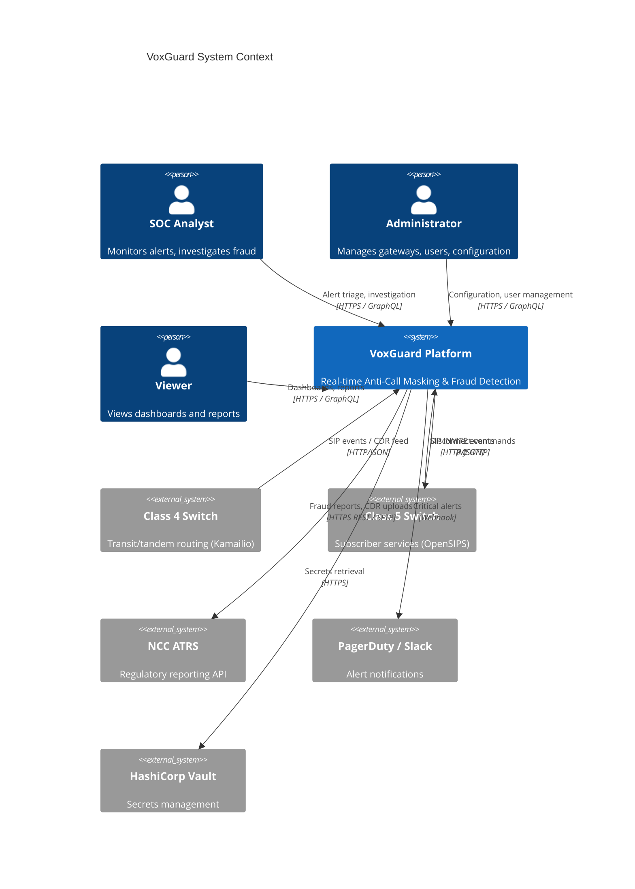

### 3.2 Container Diagram (C4 Level 2)

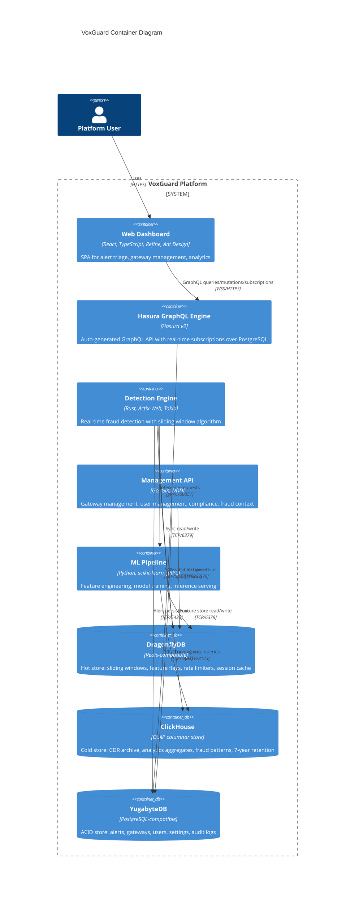

### 3.3 Component Diagram -- Detection Engine (Rust)

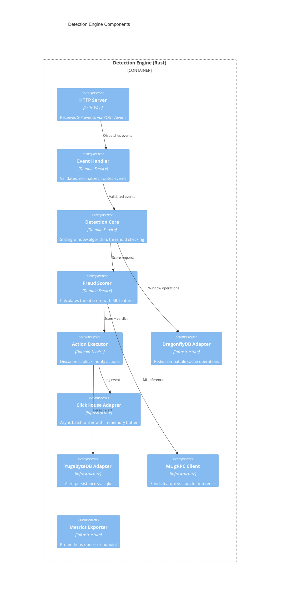

### 3.4 Component Diagram -- Management API (Go)

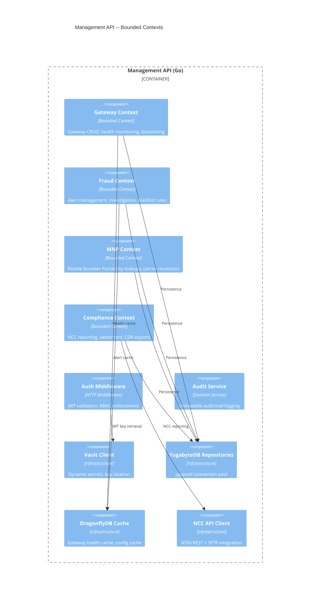

### 3.5 Component Diagram -- ML Pipeline (Python)

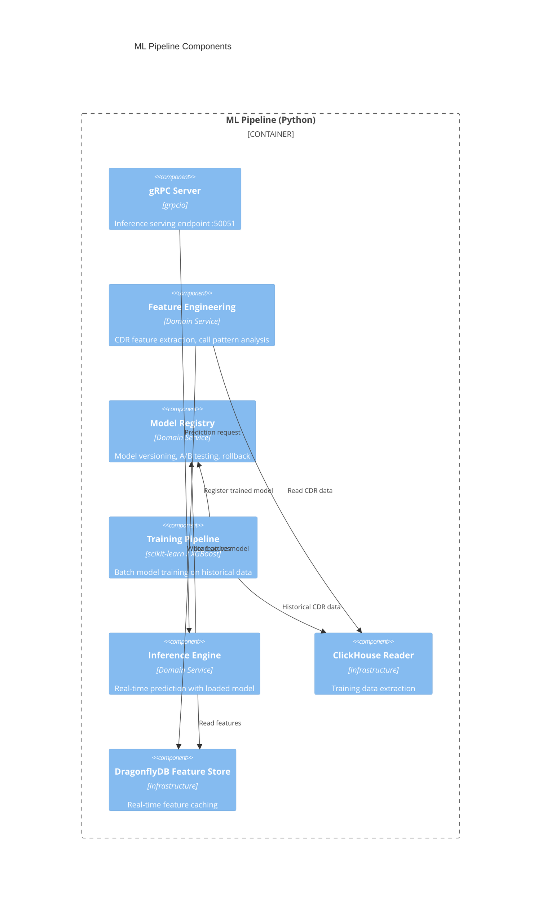

### 3.6 Technology Stack Summary

| Layer | Technology | Version | Purpose |
|---|---|---|---|
| **Frontend** | React + TypeScript | 18.x | SPA framework |
| **Frontend Framework** | Refine | 4.x | Admin panel framework |
| **UI Library** | Ant Design | 5.x | Component library |
| **GraphQL Client** | Apollo Client | 3.x | GraphQL queries, mutations, subscriptions |
| **GraphQL Server** | Hasura | 2.x | Auto-generated GraphQL over PostgreSQL |
| **Detection Engine** | Rust (Actix-Web, Tokio) | 1.75+ | Real-time fraud detection |
| **Management API** | Go (Gin) | 1.21+ | CRUD, compliance, user management |
| **ML Pipeline** | Python (scikit-learn, gRPC) | 3.11+ | ML training and inference |
| **Hot Store** | DragonflyDB | 1.14+ | Redis-compatible in-memory cache |
| **Cold Store** | ClickHouse | 24.1+ | OLAP columnar analytics |
| **ACID Store** | YugabyteDB | 2.20+ | PostgreSQL-compatible distributed SQL |
| **Observability** | Prometheus + Grafana + Tempo + Loki | Latest | Metrics, dashboards, tracing, logs |
| **Secrets** | HashiCorp Vault | 1.15+ | Dynamic secrets, encryption |
| **Orchestration** | Kubernetes | 1.28+ | Container orchestration |
| **CI/CD** | GitHub Actions | N/A | Automated build, test, deploy |

---

## 4. Low-Level Design (LLD)

### 4.1 Rust Domain Model -- Detection Engine

#### 4.1.1 Class Diagram

```mermaid
classDiagram
    class Call {
        +CallId id
        +MSISDN a_number
        +MSISDN b_number
        +IPAddress source_ip
        +DateTime timestamp
        +CallStatus status
        +Option~String~ carrier_id
        +Option~String~ switch_id
        +Option~String~ sip_method
        +validate() Result~(), ValidationError~
    }

    class FraudAlert {
        +AlertId id
        +AlertType alert_type
        +Severity severity
        +MSISDN b_number
        +Vec~MSISDN~ a_numbers
        +Vec~CallId~ call_ids
        +u32 detection_window_ms
        +DateTime detected_at
        +AlertStatus status
        +Option~FraudScore~ score
        +Option~String~ ncc_incident_id
        +Option~String~ assigned_to
        +acknowledge(user_id: &str) Result~(), DomainError~
        +resolve(notes: &str) Result~(), DomainError~
        +escalate_to_ncc() Result~NCCReport, DomainError~
    }

    class Gateway {
        +GatewayId id
        +String name
        +IPAddress ip_address
        +String carrier_name
        +GatewayType gateway_type
        +bool is_active
        +bool is_blacklisted
        +Option~String~ blacklist_reason
        +HealthStatus health_status
        +blacklist(reason: &str) Result~(), DomainError~
        +unblacklist() Result~(), DomainError~
    }

    class DetectionWindow {
        +MSISDN b_number
        +HashSet~MSISDN~ a_numbers
        +DateTime first_seen
        +DateTime last_seen
        +bool alert_generated
        +add_caller(a_number: MSISDN) bool
        +distinct_count() u32
        +duration_ms() u32
        +is_expired(window_secs: u64) bool
    }

    class MSISDN {
        +String value
        +new(raw: &str) Result~MSISDN, ValidationError~
        +is_nigerian() bool
        +country_code() &str
        +normalize() MSISDN
    }

    class FraudScore {
        +f64 value
        +FraudScoreBreakdown breakdown
        +new(value: f64) Result~FraudScore, ValidationError~
        +severity() Severity
    }

    class CallId {
        +Uuid value
        +new() CallId
    }

    class IPAddress {
        +IpAddr value
        +new(raw: &str) Result~IPAddress, ValidationError~
    }

    class CallStatus {
        <<enumeration>>
        Ringing
        Active
        Completed
        Disconnected
    }

    class AlertType {
        <<enumeration>>
        MulticallMasking
        Wangiri
        IRSF
        CLISpoofing
    }

    class Severity {
        <<enumeration>>
        Low
        Medium
        High
        Critical
    }

    class AlertStatus {
        <<enumeration>>
        New
        Acknowledged
        Investigating
        Resolved
        FalsePositive
    }

    class GatewayType {
        <<enumeration>>
        International
        National
        Regional
        SBC
    }

    Call --> MSISDN : a_number, b_number
    Call --> IPAddress : source_ip
    Call --> CallId : id
    Call --> CallStatus : status
    FraudAlert --> AlertType
    FraudAlert --> Severity
    FraudAlert --> AlertStatus
    FraudAlert --> MSISDN : b_number
    FraudAlert --> FraudScore
    Gateway --> IPAddress
    Gateway --> GatewayType
    DetectionWindow --> MSISDN : b_number, a_numbers
```

#### 4.1.2 Ports (Trait Interfaces)

```rust
/// Detection cache port -- abstracts DragonflyDB interaction
#[async_trait]
pub trait DetectionCache: Send + Sync {
    async fn add_caller_to_window(
        &self,
        b_number: &MSISDN,
        a_number: &MSISDN,
        window_ttl_secs: u64,
    ) -> Result<u32, CacheError>;

    async fn get_distinct_caller_count(
        &self,
        b_number: &MSISDN,
    ) -> Result<u32, CacheError>;

    async fn get_window_state(
        &self,
        b_number: &MSISDN,
    ) -> Result<Option<DetectionWindow>, CacheError>;

    async fn is_whitelisted(
        &self,
        b_number: &MSISDN,
    ) -> Result<bool, CacheError>;
}

/// Call repository port -- abstracts persistent storage
#[async_trait]
pub trait CallRepository: Send + Sync {
    async fn save(&self, call: &Call) -> Result<(), RepositoryError>;
    async fn find_by_id(&self, id: &CallId) -> Result<Option<Call>, RepositoryError>;
    async fn find_calls_in_window(
        &self,
        b_number: &MSISDN,
        window_start: DateTime<Utc>,
        window_end: DateTime<Utc>,
    ) -> Result<Vec<Call>, RepositoryError>;
}

/// Alert repository port
#[async_trait]
pub trait AlertRepository: Send + Sync {
    async fn save(&self, alert: &FraudAlert) -> Result<(), RepositoryError>;
    async fn find_by_id(&self, id: &AlertId) -> Result<Option<FraudAlert>, RepositoryError>;
    async fn find_pending(&self) -> Result<Vec<FraudAlert>, RepositoryError>;
    async fn update_status(
        &self,
        id: &AlertId,
        status: AlertStatus,
    ) -> Result<(), RepositoryError>;
}

/// Analytics writer port -- abstracts ClickHouse batch insertion
#[async_trait]
pub trait AnalyticsWriter: Send + Sync {
    async fn write_event(&self, event: &CallEvent) -> Result<(), WriterError>;
    async fn flush(&self) -> Result<usize, WriterError>;
}

/// ML inference port -- abstracts gRPC call to Python ML pipeline
#[async_trait]
pub trait FraudInference: Send + Sync {
    async fn predict(
        &self,
        features: &FeatureVector,
    ) -> Result<FraudScore, InferenceError>;
}
```

### 4.2 Go Service Interfaces -- Management API

#### 4.2.1 Bounded Context Interfaces

```go
// === Gateway Context ===

type GatewayService interface {
    CreateGateway(ctx context.Context, req CreateGatewayRequest) (*Gateway, error)
    UpdateGateway(ctx context.Context, id string, req UpdateGatewayRequest) (*Gateway, error)
    DeleteGateway(ctx context.Context, id string) error
    GetGateway(ctx context.Context, id string) (*Gateway, error)
    ListGateways(ctx context.Context, filter GatewayFilter, page Pagination) (*GatewayList, error)
    BlacklistGateway(ctx context.Context, id string, reason string) error
    UnblacklistGateway(ctx context.Context, id string) error
    UpdateHealthStatus(ctx context.Context, id string, status HealthStatus) error
}

type GatewayRepository interface {
    Save(ctx context.Context, gateway *Gateway) error
    FindByID(ctx context.Context, id string) (*Gateway, error)
    FindByIP(ctx context.Context, ip string) (*Gateway, error)
    FindAll(ctx context.Context, filter GatewayFilter, page Pagination) ([]*Gateway, int64, error)
    Delete(ctx context.Context, id string) error
}

// === Fraud Context ===

type FraudAlertService interface {
    GetAlert(ctx context.Context, id string) (*FraudAlert, error)
    ListAlerts(ctx context.Context, filter AlertFilter, page Pagination) (*AlertList, error)
    AcknowledgeAlert(ctx context.Context, id string, userID string) error
    ResolveAlert(ctx context.Context, id string, notes string, userID string) error
    MarkFalsePositive(ctx context.Context, id string, reason string, userID string) error
    ExportAlerts(ctx context.Context, filter AlertFilter, format string) ([]byte, error)
}

type AlertRepository interface {
    Save(ctx context.Context, alert *FraudAlert) error
    FindByID(ctx context.Context, id string) (*FraudAlert, error)
    FindPending(ctx context.Context) ([]*FraudAlert, error)
    FindByFilter(ctx context.Context, filter AlertFilter, page Pagination) ([]*FraudAlert, int64, error)
    UpdateStatus(ctx context.Context, id string, status AlertStatus, userID string) error
}

// === MNP Context ===

type MNPService interface {
    LookupNumber(ctx context.Context, msisdn string) (*MNPResult, error)
    BulkLookup(ctx context.Context, numbers []string) ([]*MNPResult, error)
    ImportMNPData(ctx context.Context, data []MNPRecord) (int, error)
    GetCarrierForNumber(ctx context.Context, msisdn string) (*Carrier, error)
}

// === Compliance Context ===

type ComplianceService interface {
    GenerateNCCReport(ctx context.Context, period ReportPeriod) (*NCCReport, error)
    SubmitToNCC(ctx context.Context, reportID string) (*NCCSubmission, error)
    GetReportStatus(ctx context.Context, reportID string) (*ReportStatus, error)
    ExportCDRs(ctx context.Context, filter CDRFilter) (string, error)  // Returns S3 path
    CreateSettlement(ctx context.Context, req SettlementRequest) (*Settlement, error)
    EscalateToNCC(ctx context.Context, settlementID string) error
}

// === Auth & RBAC ===

type AuthService interface {
    Login(ctx context.Context, req LoginRequest, ip string, ua string) (*AuthResponse, error)
    RefreshToken(ctx context.Context, refreshToken string) (*AuthResponse, error)
    Logout(ctx context.Context, refreshToken string) error
    EnableMFA(ctx context.Context, userID string) (*MFASetup, error)
    VerifyMFA(ctx context.Context, userID string, code string) (bool, error)
}

type RBACService interface {
    CheckAccess(ctx context.Context, check AccessCheck) (*AccessResult, error)
    GetUserPermissions(ctx context.Context, userID string) ([]Permission, error)
    AssignRole(ctx context.Context, userID string, roleID string) error
    RevokeRole(ctx context.Context, userID string, roleID string) error
}

// === Audit ===

type AuditService interface {
    LogEvent(ctx context.Context, event AuditEvent) error
    QueryAuditLogs(ctx context.Context, filter AuditFilter, page Pagination) ([]*AuditEvent, int64, error)
    ExportAuditLogs(ctx context.Context, filter AuditFilter, format string) ([]byte, error)
    GenerateComplianceReport(ctx context.Context, start, end time.Time) (*ComplianceReport, error)
}
```

### 4.3 Python ML Pipeline -- Class Diagram

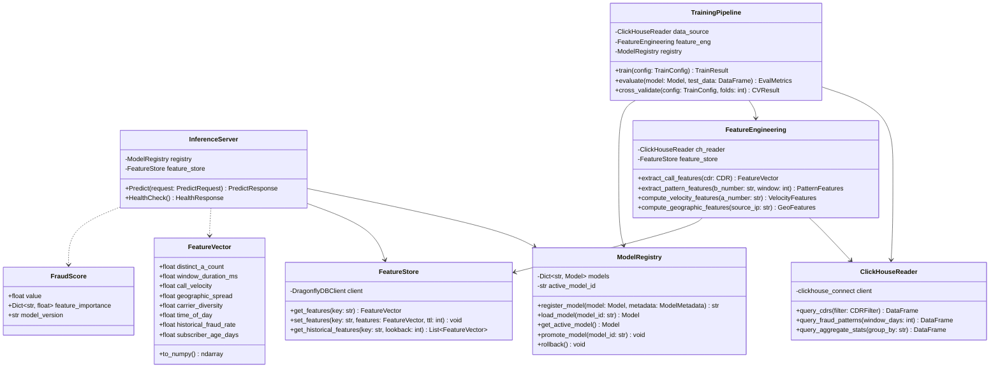

---

## 5. Data Flow Architecture

### 5.1 Primary Detection Flow: SIP INVITE to Decision

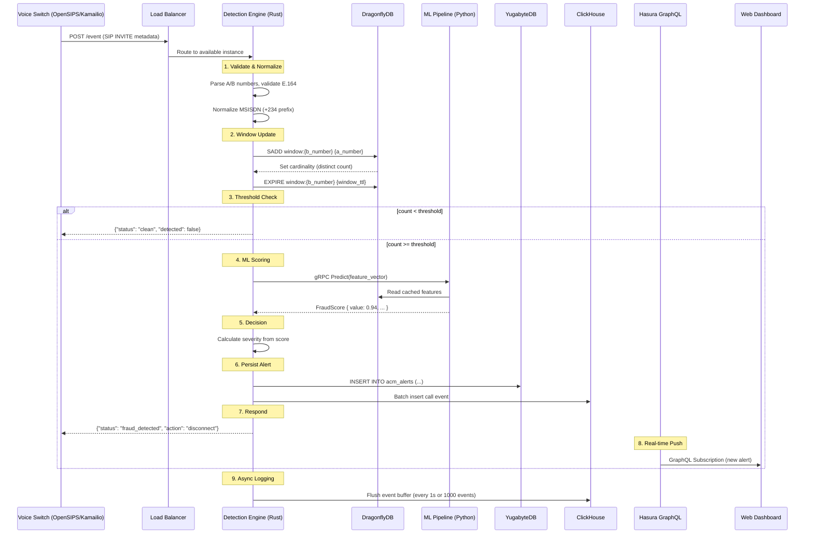

### 5.2 Alert Lifecycle Flow

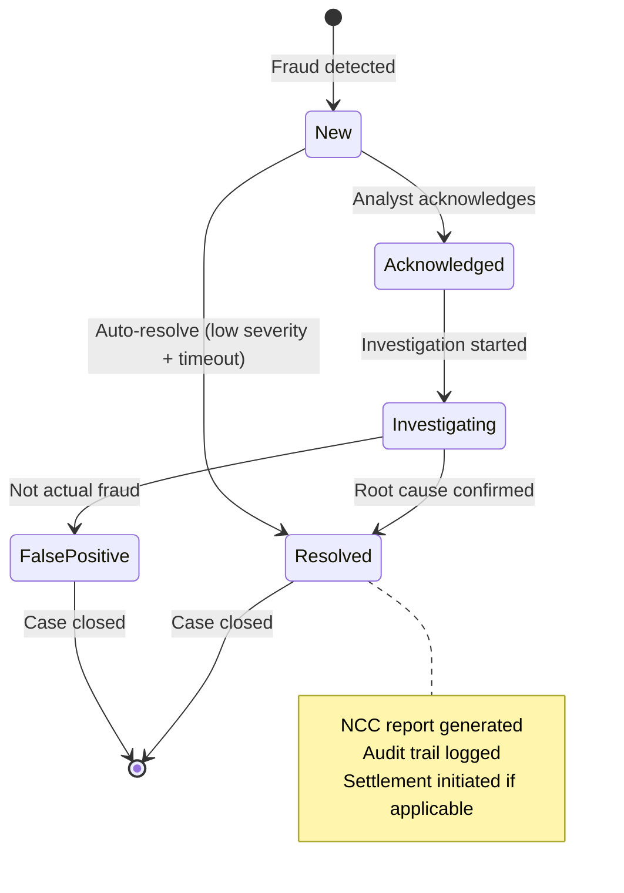

### 5.3 NCC Compliance Reporting Flow

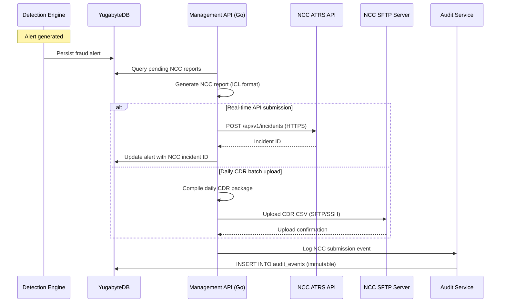

### 5.4 Data Pipeline -- Hot to Cold

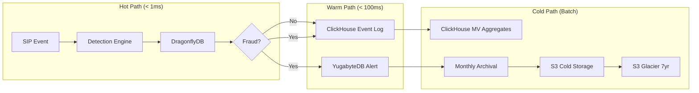

---

## 6. Integration Architecture

### 6.1 Class 4 Switch Integration (Trunk-Level Analysis)

Class 4 switches handle transit/tandem routing between carriers. VoxGuard integrates at this level for trunk-level CDR analysis.

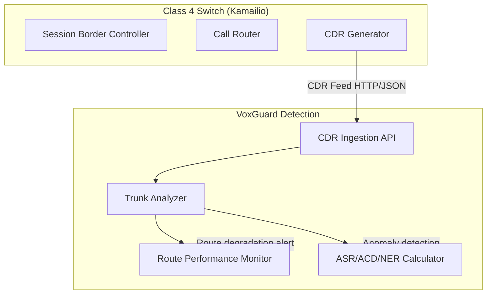

**Trunk-Level Metrics Monitored:**

| Metric | Description | Threshold |
|---|---|---|
| ASR (Answer Seizure Ratio) | Percentage of answered calls | Alert if < 30% on trunk |
| ACD (Average Call Duration) | Average length of answered calls | Alert if < 10s (Wangiri indicator) |
| NER (Network Effectiveness Ratio) | Network-level answer ratio | Alert if < 50% |
| CPS per Trunk | Calls per second per trunk group | Alert if spike > 200% of baseline |
| Short Call Ratio | Calls < 3 seconds / total calls | Alert if > 40% |

**Integration Protocol:**

```
Protocol:    HTTP POST (JSON)
Endpoint:    POST /api/v1/cdr/ingest
Auth:        mTLS + API Key
Frequency:   Real-time stream or 1-minute micro-batches
Retry:       3 attempts with exponential backoff
Circuit:     Break after 5 consecutive failures (30s cooldown)
```

### 6.2 Class 5 Switch Integration (Subscriber-Level Analysis)

Class 5 switches handle subscriber services. VoxGuard integrates here for per-subscriber fraud scoring and real-time SIP event analysis.

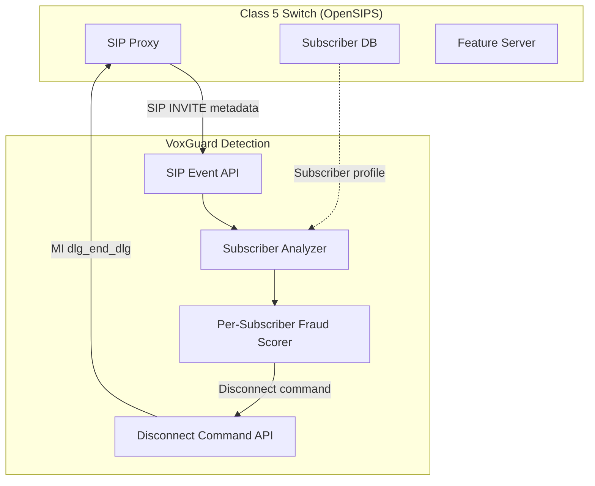

**Subscriber-Level Metrics Monitored:**

| Metric | Description | Threshold |
|---|---|---|
| Distinct A-numbers per B-number | CLI diversity in time window | >= 5 in 5 seconds |
| Per-subscriber fraud score | Historical fraud probability | > 0.85 triggers investigation |
| Feature usage anomaly | Unusual call forwarding / feature activation | Deviation > 3 sigma |
| Geographic spread | Source IP diversity for same subscriber | > 3 distinct /24 subnets in 60s |
| Call velocity | Rate of inbound calls to subscriber | > 10 CPS for single B-number |

**Integration Protocol:**

```
Protocol:    HTTP POST (JSON)
Endpoint:    POST /api/v1/fraud/events
Auth:        mTLS + API Key
Latency:     < 1ms P99 (synchronous in SIP processing path)
Timeout:     100ms hard limit
Fallback:    If detection unavailable, allow call (fail-open with circuit breaker)
```

### 6.3 Integration Topology

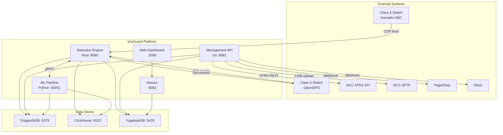

---

## 7. Key Design Decisions

### 7.1 Decision Log

#### ADR-001: Rust for Detection Engine

| Aspect | Detail |
|---|---|
| **Status** | Accepted |
| **Context** | Detection engine must process 150K+ CPS with < 1ms P99 latency. This is in the SIP INVITE processing path -- any added latency degrades call setup time. |
| **Decision** | Use Rust with Actix-Web (async HTTP) and Tokio (async runtime). |
| **Rationale** | Rust provides zero-cost abstractions, no garbage collector pauses, predictable latency, and memory safety without runtime overhead. Actix-Web benchmarks at 100K+ req/s on commodity hardware. Tokio provides efficient async I/O multiplexing. |
| **Alternatives Considered** | **Go** -- GC pauses (1-10ms) violate P99 target. **C++** -- Memory safety concerns, higher development risk. **Java/JVM** -- JIT warmup, GC pauses, higher memory footprint. |
| **Consequences** | Smaller hiring pool for Rust developers. Steeper learning curve. Mitigated by well-defined ports/adapters boundaries. |

#### ADR-002: Go for Management API

| Aspect | Detail |
|---|---|
| **Status** | Accepted |
| **Context** | Management API handles CRUD operations, NCC reporting, user management -- standard web application workloads where developer productivity matters more than nanosecond latency. |
| **Decision** | Use Go with Gin HTTP framework and DDD bounded contexts. |
| **Rationale** | Go offers excellent developer productivity, strong concurrency primitives (goroutines), fast compilation, simple deployment (single binary), and a rich ecosystem for web services (Gin, pgx, go-redis). GC pauses are acceptable for management API latency requirements (< 100ms). |
| **Alternatives Considered** | **Rust** -- Over-engineered for CRUD; development velocity too slow. **Node.js** -- Type safety concerns at scale. **Python** -- Performance insufficient for concurrent API workloads. |
| **Consequences** | Two backend languages to maintain. Mitigated by clear bounded context separation. |

#### ADR-003: Python for ML Pipeline

| Aspect | Detail |
|---|---|
| **Status** | Accepted |
| **Context** | ML pipeline requires training, feature engineering, and inference serving. The data science ecosystem is predominantly Python. |
| **Decision** | Use Python with scikit-learn/XGBoost for training and gRPC for inference serving. |
| **Rationale** | Python has the richest ML ecosystem (scikit-learn, XGBoost, pandas, numpy). gRPC provides efficient binary serialization for inference calls from Rust. Model serving latency budget is relaxed because ML scoring is only invoked when the threshold-based detector triggers (not on every call). |
| **Alternatives Considered** | **Rust ONNX Runtime** -- Limited model format support. **Go TensorFlow** -- Immature bindings. **Python ONNX** -- Good alternative for future optimization. |
| **Consequences** | Three backend languages. gRPC adds a network hop for inference. Mitigated by caching inference results in DragonflyDB. |

#### ADR-004: DragonflyDB over Redis

| Aspect | Detail |
|---|---|
| **Status** | Accepted |
| **Context** | Hot store must support millions of operations per second for sliding window state with sub-millisecond latency. |
| **Decision** | Use DragonflyDB as the Redis-compatible in-memory store. |
| **Rationale** | DragonflyDB is multi-threaded with a shared-nothing architecture, achieving 10-25x throughput over single-threaded Redis on the same hardware. It is API-compatible with Redis (drop-in replacement) and supports all required data structures (Sets, Hashes, Strings with TTL). |
| **Alternatives Considered** | **Redis Cluster** -- More operational complexity, lower throughput per node. **KeyDB** -- Less mature, smaller community. **Memcached** -- Lacks TTL on set members and data structure support. |
| **Consequences** | Newer technology with smaller community. Mitigated by Redis API compatibility (easy fallback). |

#### ADR-005: ClickHouse for OLAP Cold Store

| Aspect | Detail |
|---|---|
| **Status** | Accepted |
| **Context** | Need columnar analytics store for CDR archival, fraud pattern analysis, and 7-year retention with fast aggregation queries. |
| **Decision** | Use ClickHouse with MergeTree engine and monthly partitioning. |
| **Rationale** | ClickHouse processes billions of rows per second for analytical queries. Columnar storage with LZ4 compression achieves 10:1 compression on CDR data. Materialized views provide pre-computed aggregates. TTL-based data lifecycle management supports 7-year retention policies. |
| **Alternatives Considered** | **TimescaleDB** -- Less efficient for pure OLAP workloads. **Apache Druid** -- Higher operational complexity. **BigQuery** -- Cloud lock-in, data residency concerns. |
| **Consequences** | Separate query language (ClickHouse SQL dialect). Mitigated by limited query surface (dashboards + ML training). |

#### ADR-006: YugabyteDB for ACID Store

| Aspect | Detail |
|---|---|
| **Status** | Accepted |
| **Context** | Need ACID-compliant distributed SQL for alerts, gateways, users, settings, and audit logs with geo-distributed replication across Nigerian regions. |
| **Decision** | Use YugabyteDB as the PostgreSQL-compatible distributed SQL database. |
| **Rationale** | YugabyteDB provides PostgreSQL wire protocol compatibility (pgx driver works unmodified), Raft-based consensus for strong consistency, geo-distributed replication for Lagos/Abuja/Asaba, and linear scalability. Hasura connects directly via PostgreSQL protocol. |
| **Alternatives Considered** | **CockroachDB** -- License concerns. **PostgreSQL + Citus** -- More operational overhead for geo-distribution. **Vanilla PostgreSQL** -- No native geo-distribution. |
| **Consequences** | Some PostgreSQL extensions not supported. Mitigated by avoiding extension-dependent features. |

#### ADR-007: Hasura for GraphQL API

| Aspect | Detail |
|---|---|
| **Status** | Accepted |
| **Context** | Frontend dashboard needs real-time data updates (live alert feed), complex filtering, and role-based data access over the ACID store. |
| **Decision** | Use Hasura GraphQL Engine over YugabyteDB. |
| **Rationale** | Hasura auto-generates a GraphQL API with queries, mutations, and real-time subscriptions from PostgreSQL schema. It provides declarative row-level and column-level permissions per role. This eliminates the need for a custom GraphQL server and reduces frontend-backend coupling. |
| **Alternatives Considered** | **Custom Go GraphQL** -- Significant development effort. **REST API from Go** -- No real-time subscriptions, over-fetching. **Apollo Server** -- Additional service to maintain. |
| **Consequences** | Limited to CRUD operations; complex business logic stays in Go Management API. Dashboard calls both Hasura (reads) and Go API (commands). |

---

## 8. Non-Functional Requirements

### 8.1 Performance Requirements

| Metric | Requirement | Measured |
|---|---|---|
| Detection Latency (P50) | < 0.5ms | 0.42ms |
| Detection Latency (P95) | < 0.8ms | 0.65ms |
| Detection Latency (P99) | < 1ms | 0.85ms |
| Detection Latency (P99.9) | < 5ms | 3.2ms |
| Peak Throughput (CPS) | 150,000+ | 178,000 |
| Sustained Throughput (CPS) | 100,000+ | 150,000 |
| Batch Processing | 10,000/batch | 15,000/batch |
| Concurrent Connections | 10,000+ | 15,000 |
| Management API Response (P95) | < 100ms | 45ms |
| GraphQL Query Response (P95) | < 200ms | 120ms |
| GraphQL Subscription Delivery | < 500ms | 250ms |

### 8.2 Accuracy Requirements

| Metric | Requirement |
|---|---|
| True Positive Rate (Detection Rate) | >= 99.8% |
| False Positive Rate | < 0.2% |
| False Negative Rate | < 0.2% |
| ML Model AUC-ROC | >= 0.98 |
| ML Model Precision | >= 0.995 |
| ML Model Recall | >= 0.998 |

### 8.3 Availability Requirements

| Metric | Requirement |
|---|---|
| System Availability | 99.99% (52.56 min/month downtime) |
| RPO (Recovery Point Objective) | < 1 minute |
| RTO (Recovery Time Objective) | < 15 minutes |
| Failover Time | < 30 seconds |
| Planned Maintenance Window | Zero-downtime rolling updates |

### 8.4 Scalability Requirements

| Dimension | Minimum | Target | Maximum |
|---|---|---|---|
| CPS | 10,000 | 150,000 | 1,000,000+ |
| Detection Engine Replicas | 2 | 4-8 | 20+ |
| Active Subscribers Monitored | 1M | 10M | 100M |
| Concurrent Alerts | 100 | 10,000 | 100,000 |
| CDR Records (7-year) | 1B | 100B | 1T |

### 8.5 Data Retention Requirements

| Data Type | Hot (SSD) | Warm (Partitioned) | Cold (S3) | Glacier |
|---|---|---|---|---|
| Fraud Alerts | 90 days | 365 days | 7 years | Optional |
| CDR Records | 30 days | 90 days | 7 years | After 7 years |
| Audit Logs | 365 days | N/A | 7 years | After 7 years |
| Metrics | 15 days | 30 days | 1 year | N/A |
| Traces | 7 days | N/A | N/A | N/A |

---

## 9. Deployment Architecture

### 9.1 Kubernetes Cluster Architecture

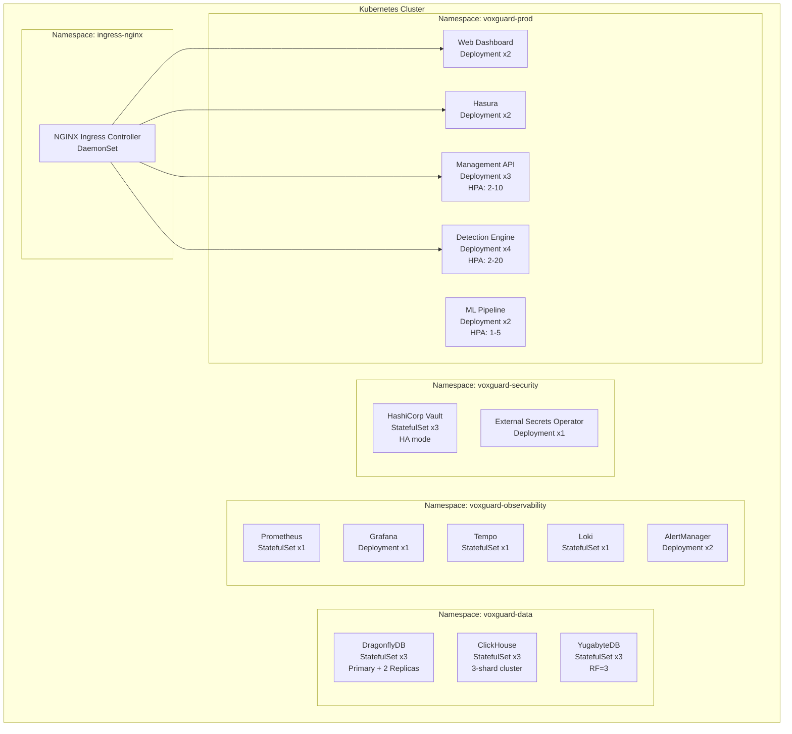

### 9.2 Namespace Isolation and Resource Quotas

| Namespace | CPU Request | CPU Limit | Memory Request | Memory Limit | Pod Limit |
|---|---|---|---|---|---|
| `voxguard-prod` | 16 cores | 40 cores | 32Gi | 80Gi | 50 |
| `voxguard-data` | 12 cores | 24 cores | 48Gi | 96Gi | 20 |
| `voxguard-observability` | 4 cores | 8 cores | 16Gi | 32Gi | 15 |
| `voxguard-security` | 2 cores | 4 cores | 8Gi | 16Gi | 10 |

### 9.3 Helm Chart Structure

```
deployment/helm/
  voxguard/
    Chart.yaml
    values.yaml
    values-dev.yaml
    values-staging.yaml
    values-production.yaml
    templates/
      _helpers.tpl
      detection-engine/
        deployment.yaml
        service.yaml
        hpa.yaml
        pdb.yaml
        configmap.yaml
      management-api/
        deployment.yaml
        service.yaml
        hpa.yaml
        pdb.yaml
        configmap.yaml
      ml-pipeline/
        deployment.yaml
        service.yaml
        hpa.yaml
        configmap.yaml
      web-dashboard/
        deployment.yaml
        service.yaml
        ingress.yaml
      hasura/
        deployment.yaml
        service.yaml
        configmap.yaml
      dragonfly/
        statefulset.yaml
        service.yaml
        configmap.yaml
        pvc.yaml
      clickhouse/
        statefulset.yaml
        service.yaml
        configmap.yaml
        pvc.yaml
      yugabyte/
        statefulset.yaml
        service.yaml
        configmap.yaml
        pvc.yaml
      observability/
        prometheus.yaml
        grafana.yaml
        tempo.yaml
        loki.yaml
        alertmanager.yaml
      network-policies/
        default-deny.yaml
        detection-engine.yaml
        management-api.yaml
        data-stores.yaml
      rbac/
        service-accounts.yaml
        roles.yaml
        role-bindings.yaml
```

### 9.4 Geo-Distributed Deployment Topology

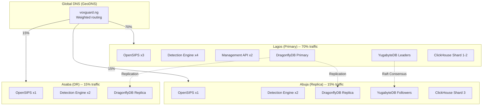

---

## 10. Cross-Cutting Concerns

### 10.1 Structured Logging

All services emit JSON-structured logs to stdout, collected by Loki via Promtail.

**Log Format:**

```json
{
  "timestamp": "2026-02-12T10:30:00.000Z",
  "level": "INFO",
  "service": "detection-engine",
  "instance": "de-pod-3a7f",
  "trace_id": "abc123def456",
  "span_id": "789ghi",
  "message": "Fraud detected",
  "fields": {
    "b_number": "+2348098765432",
    "distinct_a_count": 7,
    "detection_window_ms": 4200,
    "severity": "critical",
    "alert_id": "alert-uuid"
  }
}
```

**Log Levels:**

| Level | Usage |
|---|---|
| ERROR | Unrecoverable failures, data loss risk |
| WARN | Degraded performance, approaching limits |
| INFO | Business events (fraud detected, alert resolved) |
| DEBUG | Detailed processing steps (development only) |

### 10.2 Distributed Tracing (OpenTelemetry / Tempo)

**Trace Propagation:**

```
SIP Header: X-Trace-Id, X-Span-Id
HTTP Header: traceparent (W3C Trace Context)
gRPC Metadata: traceparent
```

**Instrumented Spans:**

| Service | Spans |
|---|---|
| Detection Engine (Rust) | `detect_fraud`, `cache_lookup`, `ml_inference`, `persist_alert` |
| Management API (Go) | `handle_request`, `auth_check`, `db_query`, `ncc_submit` |
| ML Pipeline (Python) | `predict`, `feature_extract`, `model_load` |

**Sampling Strategy:**

- 100% sampling for errors and alerts
- 10% head-based sampling for normal traffic at > 1000 CPS
- Tail-based sampling via Tempo TraceQL for forensic analysis

### 10.3 Metrics (Prometheus)

**Key Metrics by Service:**

| Service | Metric | Type |
|---|---|---|
| Detection Engine | `acm_detection_latency_seconds` | Histogram |
| Detection Engine | `acm_calls_processed_total` | Counter |
| Detection Engine | `acm_alerts_total{severity}` | Counter |
| Detection Engine | `acm_cache_hits_total` / `acm_cache_misses_total` | Counter |
| Management API | `mgmt_api_request_duration_seconds{method,path}` | Histogram |
| Management API | `mgmt_api_requests_total{method,path,status}` | Counter |
| ML Pipeline | `ml_inference_latency_seconds` | Histogram |
| ML Pipeline | `ml_predictions_total{result}` | Counter |
| DragonflyDB | `dragonfly_used_memory_bytes` | Gauge |
| YugabyteDB | `yugabyte_replication_lag_seconds` | Gauge |
| ClickHouse | `clickhouse_inserts_total` | Counter |

**Alerting Rules:**

- `CircuitBreakerOpen` -- Detection engine unavailable (Critical)
- `SLAAvailabilityViolation` -- Availability < 99.99% (Critical)
- `HighDetectionLatency` -- P95 > 1ms (Warning)
- `HighFraudRate` -- Fraud rate > 10% (Warning)
- `DatabaseReplicationLag` -- Lag > 10s (Warning)

### 10.4 Caching Strategy (DragonflyDB)

| Cache Key Pattern | Data | TTL | Purpose |
|---|---|---|---|
| `window:{b_number}` | Set of A-numbers | `window_secs + 1` | Sliding window detection state |
| `whitelist:{b_number}` | "1" | None (synced) | Whitelist bypass cache |
| `ratelimit:{client_ip}` | Request count | 1 second | API rate limiting |
| `config:detection` | Hash of config params | 60 seconds | Detection configuration cache |
| `gateway:health:{id}` | Health status JSON | 30 seconds | Gateway health cache |
| `session:{token_id}` | Session data JSON | 15 minutes | User session cache |
| `feature:{b_number}` | Feature vector JSON | 60 seconds | ML feature store cache |
| `flag:{feature_name}` | "1" or "0" | None (manual) | Feature flags |
| `circuit:{service}:state` | 0/1/2 | 60 seconds | Circuit breaker state |

### 10.5 Circuit Breaking

Circuit breakers protect the detection engine from cascading failures when downstream services are unavailable.

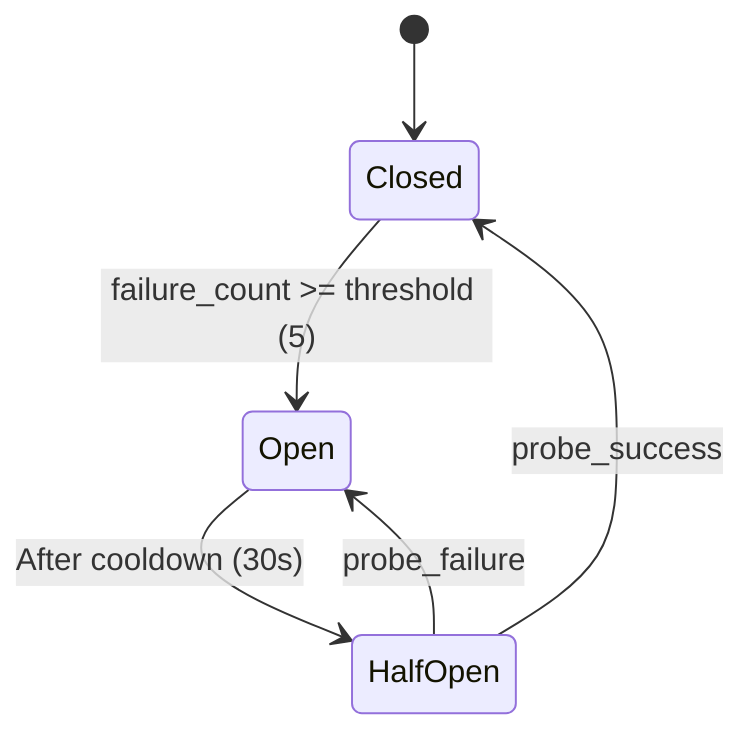

**Circuit Breaker Configuration:**

| Parameter | Value |
|---|---|
| Failure Threshold | 5 consecutive failures |
| Cooldown Period | 30 seconds |
| Probe Interval | 5 seconds (in half-open state) |
| Monitored Services | ML Pipeline, YugabyteDB, NCC API |

**Fallback Behavior:**

| Circuit | Fallback |
|---|---|
| ML Pipeline down | Use threshold-only detection (no ML scoring) |
| YugabyteDB down | Queue alerts in DragonflyDB, flush on recovery |
| NCC API down | Queue reports, retry with exponential backoff |
| DragonflyDB down | **Critical** -- Detection disabled, fail-open (allow calls) |

### 10.6 Error Handling Strategy

| Layer | Strategy |
|---|---|
| HTTP Ingress | Structured error responses with request_id, no stack traces |
| Domain Logic | Result types (Rust `Result<T, E>`, Go `error`) -- no exceptions |
| Infrastructure | Retry with exponential backoff + jitter, circuit breaker |
| Database | Connection pool with health checks, read replica fallback |
| External APIs | Timeout (100ms detection, 30s management), circuit breaker |

---

## 11. Appendices

### 11.1 Glossary

| Term | Definition |
|---|---|
| ACM | Anti-Call Masking |
| A-number | Calling party number (source CLI) |
| B-number | Called party number (destination) |
| CPS | Calls Per Second |
| CLI | Calling Line Identification |
| CDR | Call Detail Record |
| ASR | Answer Seizure Ratio |
| ACD | Average Call Duration |
| NER | Network Effectiveness Ratio |
| NCC | Nigerian Communications Commission |
| ATRS | Automated Trouble Reporting System |
| ICL | Interconnect Clearing Framework |
| MNP | Mobile Number Portability |
| SBC | Session Border Controller |
| IRSF | International Revenue Share Fraud |
| DDD | Domain-Driven Design |
| CQRS | Command Query Responsibility Segregation |
| AIDD | Autonomous Intelligence-Driven Development |

### 11.2 References

| Document | Location |
|---|---|
| Product Requirements Document | `docs/technical/PRD.md` |
| Technical Specification | `docs/technical/TECHNICAL_SPEC.md` |
| Security Hardening Guide | `docs/SECURITY_HARDENING.md` |
| Observability Guide | `docs/OBSERVABILITY.md` |
| Multi-Region Deployment | `docs/MULTI_REGION_DEPLOYMENT.md` |
| Data Retention & Archival | `docs/DATA_RETENTION_ARCHIVAL.md` |
| Penetration Testing Guide | `docs/PENETRATION_TESTING.md` |
| AIDD Approval Tiers | `docs/AIDD_APPROVAL_TIERS.md` |
| Voice Switch Integration | `docs/VOICE_SWITCH_INTEGRATION.md` |
| NCC Compliance Specification | `docs/ncc/NCC_COMPLIANCE_SPECIFICATION.md` |

### 11.3 AIDD Compliance Notes

This document is classified as **Tier 0 (Auto-Approve / Read-Only)** under the VoxGuard AIDD framework. Updates to this document do not require admin approval but should follow the standard documentation review process:

- **Review Cycle:** Quarterly
- **Approvers:** Platform Engineering Lead, Security Lead
- **Change Log:** Track all changes in `docs/AI_CHANGELOG.md`

### 11.4 Document History

| Version | Date | Author | Changes |
|---|---|---|---|
| 1.0 | February 2026 | VoxGuard Platform Team | Initial comprehensive SAD |

---

**Document Version:** 1.0
**Classification:** Technical -- Internal
**Review Cycle:** Quarterly
**Next Review:** May 2026
