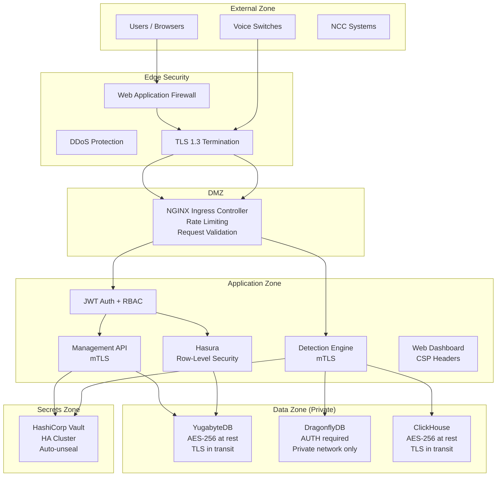
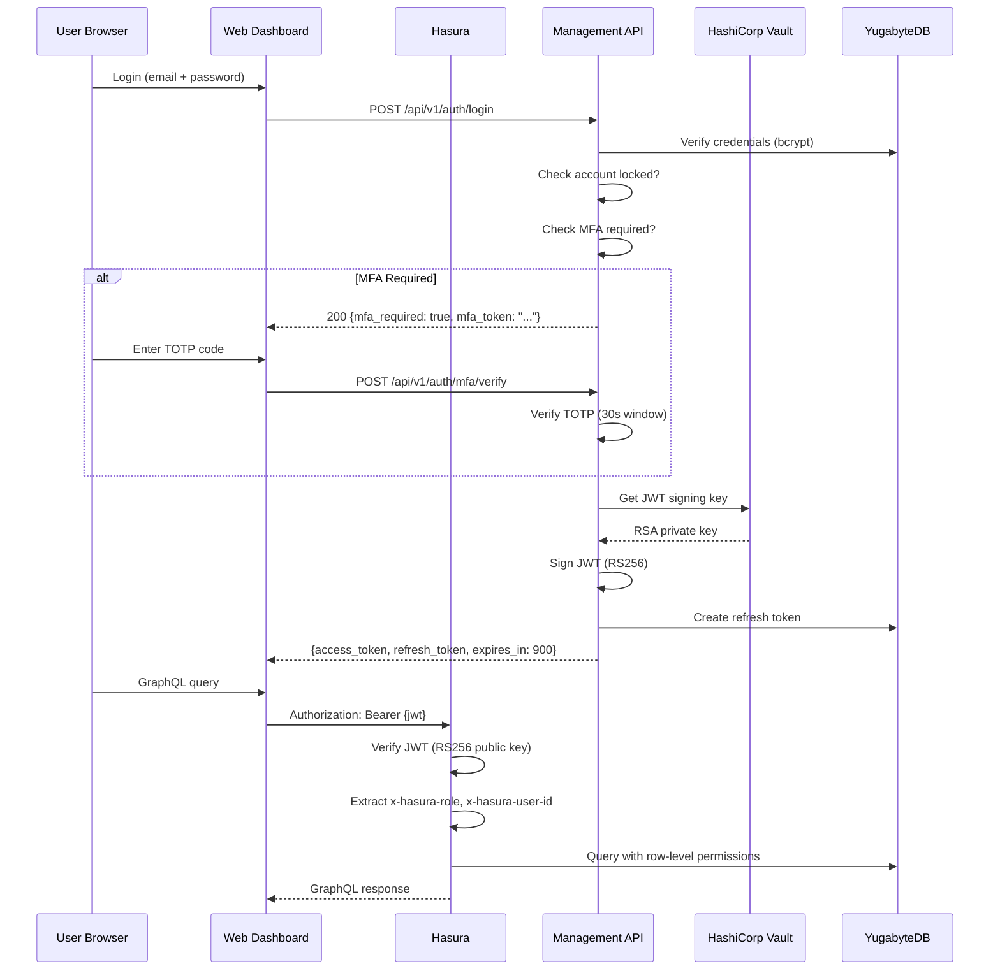
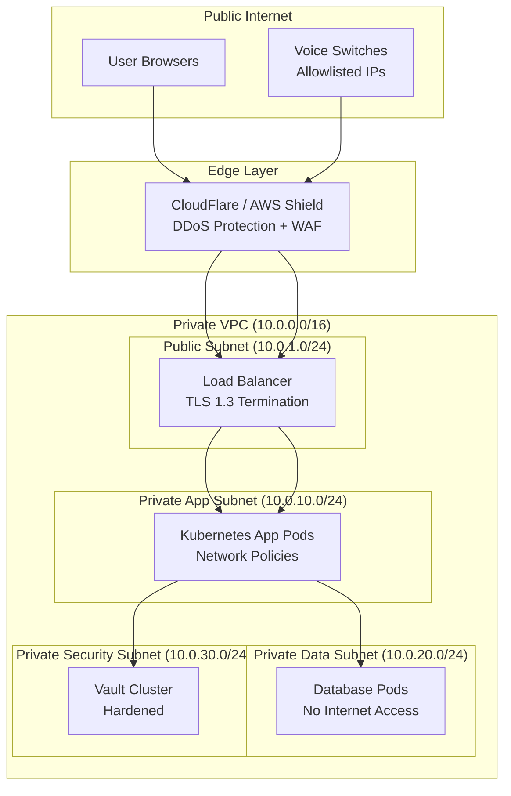
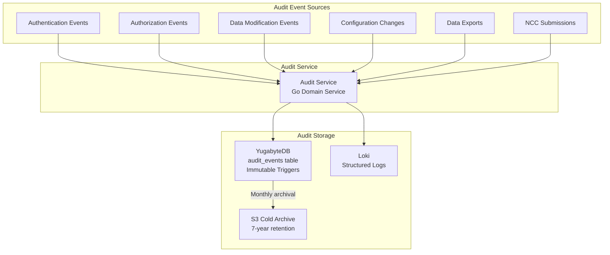
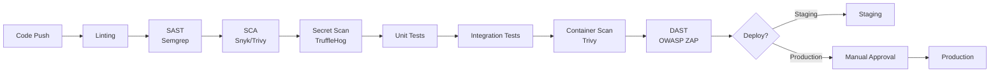
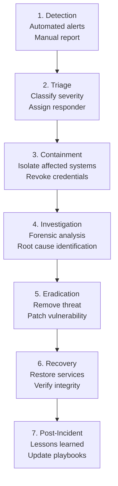

# Security Architecture

## VoxGuard -- Anti-Call Masking & Voice Network Fraud Detection Platform

**Version:** 1.0
**Date:** February 2026
**Status:** Production
**Classification:** Confidential -- Internal
**AIDD Compliance:** Tier 0 (Documentation)

---

## Table of Contents

1. [Security Overview](#1-security-overview)
2. [Threat Model](#2-threat-model)
3. [Authentication](#3-authentication)
4. [Authorization](#4-authorization)
5. [Network Security](#5-network-security)
6. [Data Security](#6-data-security)
7. [API Security](#7-api-security)
8. [Audit and Logging](#8-audit-and-logging)
9. [AIDD Security](#9-aidd-security)
10. [Incident Response](#10-incident-response)
11. [Vulnerability Management](#11-vulnerability-management)
12. [Penetration Testing](#12-penetration-testing)
13. [Compliance Mapping](#13-compliance-mapping)
14. [Security Operations Runbook](#14-security-operations-runbook)

---

## 1. Security Overview

### 1.1 Security Objectives

VoxGuard implements a defense-in-depth security architecture aligned with the following objectives:

| Objective | Implementation |
|---|---|
| **Confidentiality** | Encryption at rest and in transit, RBAC, data classification |
| **Integrity** | Immutable audit logs, checksums, tamper detection |
| **Availability** | 99.99% SLA, DDoS protection, circuit breakers, geo-distribution |
| **Accountability** | Comprehensive audit trail, 7-year retention, non-repudiation |
| **Compliance** | NCC ICL Framework 2026, ISO 27001:2022, GDPR alignment |

### 1.2 Security Architecture Overview



### 1.3 Trust Boundaries

| Boundary | Description | Controls |
|---|---|---|
| Internet -> Edge | Untrusted external traffic | WAF, DDoS, TLS termination |
| Edge -> DMZ | Filtered traffic | Rate limiting, request validation, IP allowlisting (switches) |
| DMZ -> Application | Authenticated traffic | JWT validation, RBAC enforcement |
| Application -> Data | Authorized queries | mTLS, connection pooling, parameterized queries |
| Application -> Secrets | Privileged access | Vault policies, short-lived tokens, audit logging |

---

## 2. Threat Model

### 2.1 Assets

| Asset | Classification | Impact if Compromised |
|---|---|---|
| CDR Data (phone numbers, call metadata) | Confidential | Privacy violation, regulatory fine |
| Fraud Detection Algorithms | Proprietary | Attackers learn evasion techniques |
| ML Models | Proprietary | Model poisoning, detection bypass |
| NCC API Credentials | Critical | Unauthorized regulatory submissions |
| User Credentials | Critical | Unauthorized access, data exfiltration |
| Database Credentials | Critical | Full data access, data destruction |
| JWT Signing Keys | Critical | Token forgery, full system compromise |
| Audit Logs | Integrity-Critical | Evidence tampering, compliance failure |

### 2.2 Threat Actors

| Actor | Motivation | Capability | Likelihood |
|---|---|---|---|
| External Attacker | Financial gain, data theft | Medium-High | High |
| Fraud Operators | Evade detection | Medium | High |
| Malicious Insider | Financial gain, sabotage | High (authenticated) | Medium |
| Compromised Service Account | Lateral movement | High (within scope) | Low-Medium |
| APT (Nation State) | Espionage, disruption | Very High | Low |
| Script Kiddie | Curiosity, reputation | Low | Medium |

### 2.3 STRIDE Analysis

| Threat | Category | Mitigation |
|---|---|---|
| Token forgery | Spoofing | RS256 asymmetric JWT, key rotation every 90 days |
| CDR data modification | Tampering | Immutable audit logs, database triggers, checksums |
| Fraud report forgery | Repudiation | Audit trail with user ID, IP, timestamp |
| CDR data exposure | Information Disclosure | Column-level encryption, RBAC, TLS |
| Detection engine overload | Denial of Service | Rate limiting, circuit breakers, HPA auto-scaling |
| Role escalation | Elevation of Privilege | RBAC with policy-based conditions, audit logging |

---

## 3. Authentication

### 3.1 Authentication Architecture



### 3.2 JWT Implementation

**Token Structure (RS256):**

```json
{
  "header": {
    "alg": "RS256",
    "typ": "JWT",
    "kid": "voxguard-2026-02"
  },
  "payload": {
    "sub": "user-uuid",
    "iss": "voxguard-management-api",
    "aud": "voxguard-platform",
    "iat": 1707753600,
    "exp": 1707754500,
    "nbf": 1707753600,
    "jti": "unique-token-uuid",
    "user_id": "user-uuid",
    "email": "analyst@voxguard.ng",
    "name": "John Analyst",
    "roles": ["analyst"],
    "permissions": ["fraud_alert:read", "fraud_alert:update", "gateway:read"],
    "https://hasura.io/jwt/claims": {
      "x-hasura-allowed-roles": ["analyst"],
      "x-hasura-default-role": "analyst",
      "x-hasura-user-id": "user-uuid"
    }
  }
}
```

**Token Lifetimes:**

| Token | Lifetime | Storage | Revocation |
|---|---|---|---|
| Access Token | 15 minutes | Memory only (JavaScript) | Short-lived; not stored server-side |
| Refresh Token | 7 days | HttpOnly Secure cookie | Stored as SHA-256 hash in `refresh_tokens` table |
| API Key | 90 days (configurable) | Vault | Revocable via admin endpoint |

**Key Management:**

| Parameter | Value |
|---|---|
| Algorithm | RS256 (RSA 2048-bit) |
| Key Storage | HashiCorp Vault KV v2 |
| Key Rotation | Every 90 days |
| Previous Key Grace Period | 24 hours (verify old tokens during rotation) |
| Key ID (`kid`) | `voxguard-{year}-{month}` |

### 3.3 Multi-Factor Authentication (MFA)

| Parameter | Value |
|---|---|
| Algorithm | TOTP (RFC 6238) |
| Digits | 6 |
| Period | 30 seconds |
| Hash | SHA-1 (per RFC) |
| Backup Codes | 10 single-use codes generated at setup |
| Storage | TOTP secret encrypted via Vault Transit engine |

**MFA Enforcement Policy:**

| Role | MFA Requirement |
|---|---|
| `admin` | Mandatory |
| `analyst` | Mandatory |
| `developer` | Recommended (enforced after 2026-Q3) |
| `viewer` | Optional |

### 3.4 Account Security

**Password Policy:**

| Requirement | Value |
|---|---|
| Minimum Length | 12 characters |
| Complexity | Uppercase + lowercase + digit + special character |
| History | Last 5 passwords cannot be reused |
| Maximum Age | 90 days |
| Hashing | bcrypt, cost factor 12 |
| Dictionary Check | Common password list rejection |

**Account Lockout:**

| Parameter | Value |
|---|---|
| Maximum Failed Attempts | 5 |
| Lockout Duration | 30 minutes |
| Auto-Unlock | Yes, after lockout period |
| Admin Override | Yes, immediate unlock via admin endpoint |
| Audit Logging | Every failed attempt logged with IP and user agent |

---

## 4. Authorization

### 4.1 RBAC Model

```mermaid
flowchart TD
    subgraph Roles["System Roles"]
        Admin[admin<br>Full system access]
        Analyst[analyst<br>Fraud investigation]
        Developer[developer<br>Technical access]
        Viewer[viewer<br>Read-only]
    end

    subgraph Resources["Protected Resources"]
        Alerts[Fraud Alerts]
        Gateways[Gateways]
        Users[Users]
        Settings[Settings]
        Reports[NCC Reports]
        AuditLogs[Audit Logs]
    end

    Admin -->|Full CRUD| Alerts
    Admin -->|Full CRUD| Gateways
    Admin -->|Full CRUD| Users
    Admin -->|Full CRUD| Settings
    Admin -->|Generate + Submit| Reports
    Admin -->|Read| AuditLogs

    Analyst -->|Read + Update| Alerts
    Analyst -->|Read + Blacklist| Gateways
    Analyst -->|Read (limited)| Users
    Analyst -->|Read (non-sensitive)| Settings
    Analyst -->|Generate| Reports

    Developer -->|Read (limited)| Alerts
    Developer -->|Read (limited)| Gateways
    Developer -->|Read (non-sensitive)| Settings

    Viewer -->|Read (summary)| Alerts
    Viewer -->|Read (basic)| Gateways
```

### 4.2 Permission Matrix

| Permission | admin | analyst | developer | viewer |
|---|---|---|---|---|
| `user:create` | Yes | No | No | No |
| `user:read` | Yes | Limited | No | No |
| `user:update` | Yes | No | No | No |
| `user:delete` | Yes | No | No | No |
| `gateway:create` | Yes | No | No | No |
| `gateway:read` | Yes | Yes | Limited | Basic |
| `gateway:update` | Yes | Limited | No | No |
| `gateway:delete` | Yes | No | No | No |
| `gateway:blacklist` | Yes | Yes | No | No |
| `fraud_alert:read` | Yes | Yes | Limited | Summary |
| `fraud_alert:update` | Yes | Yes | No | No |
| `fraud_alert:acknowledge` | Yes | Yes | No | No |
| `fraud_alert:resolve` | Yes | Yes | No | No |
| `setting:read` | Yes | Non-sensitive | Non-sensitive | No |
| `setting:update` | Yes | No | No | No |
| `compliance:generate` | Yes | Yes | No | No |
| `compliance:submit` | Yes | No | No | No |
| `audit:read` | Yes | Yes | No | No |
| `audit:export` | Yes | No | No | No |

### 4.3 Hasura Row-Level Security

Hasura enforces row-level and column-level permissions declaratively:

```yaml
# Example: acm_settings -- analyst can only see non-sensitive settings
- role: analyst
  permission:
    columns:
      - id
      - key
      - value
      - description
      - category
    filter:
      is_sensitive:
        _eq: false
```

### 4.4 Policy-Based Access Control (PBAC)

Beyond RBAC, VoxGuard supports conditional policies:

```json
{
  "name": "analyst_can_resolve_non_critical",
  "resource": "fraud_alert",
  "action": "resolve",
  "effect": "allow",
  "conditions": {
    "severity": {"$in": ["low", "medium", "high"]},
    "user.role": "analyst"
  },
  "description": "Analysts can resolve non-critical alerts. Critical alerts require admin."
}
```

```json
{
  "name": "admin_required_for_critical_resolve",
  "resource": "fraud_alert",
  "action": "resolve",
  "effect": "deny",
  "conditions": {
    "severity": "critical",
    "user.role": {"$ne": "admin"}
  },
  "description": "Only admins can resolve critical alerts."
}
```

---

## 5. Network Security

### 5.1 Network Architecture



### 5.2 mTLS Between Services

All inter-service communication within the cluster uses mutual TLS:

| Source | Destination | Protocol | Certificate |
|---|---|---|---|
| Detection Engine | DragonflyDB | mTLS (Redis + TLS) | Service mesh cert |
| Detection Engine | ClickHouse | mTLS (HTTPS) | Service mesh cert |
| Detection Engine | YugabyteDB | mTLS (PostgreSQL + TLS) | Service mesh cert |
| Detection Engine | ML Pipeline | mTLS (gRPC + TLS) | Service mesh cert |
| Management API | YugabyteDB | mTLS (PostgreSQL + TLS) | Service mesh cert |
| Management API | Vault | mTLS (HTTPS) | Vault client cert |
| Hasura | YugabyteDB | TLS (PostgreSQL + TLS) | Database cert |

### 5.3 Kubernetes Network Policies

```yaml
# Default deny all ingress and egress
apiVersion: networking.k8s.io/v1
kind: NetworkPolicy
metadata:
  name: default-deny-all
  namespace: voxguard-prod
spec:
  podSelector: {}
  policyTypes:
  - Ingress
  - Egress

---
# Allow detection engine to access DragonflyDB, ClickHouse, YugabyteDB, ML Pipeline
apiVersion: networking.k8s.io/v1
kind: NetworkPolicy
metadata:
  name: detection-engine-egress
  namespace: voxguard-prod
spec:
  podSelector:
    matchLabels:
      app: detection-engine
  policyTypes:
  - Egress
  egress:
  - to:
    - namespaceSelector:
        matchLabels:
          name: voxguard-data
      podSelector:
        matchLabels:
          app: dragonfly
    ports:
    - protocol: TCP
      port: 6379
  - to:
    - namespaceSelector:
        matchLabels:
          name: voxguard-data
      podSelector:
        matchLabels:
          app: clickhouse
    ports:
    - protocol: TCP
      port: 8123
  - to:
    - namespaceSelector:
        matchLabels:
          name: voxguard-data
      podSelector:
        matchLabels:
          app: yugabyte
    ports:
    - protocol: TCP
      port: 5433
  - to:
    - podSelector:
        matchLabels:
          app: ml-pipeline
    ports:
    - protocol: TCP
      port: 50051
  # DNS resolution
  - to:
    - namespaceSelector: {}
      podSelector:
        matchLabels:
          k8s-app: kube-dns
    ports:
    - protocol: UDP
      port: 53
```

### 5.4 WAF Rules

| Rule | Action | Description |
|---|---|---|
| OWASP CRS 3.3 | Block | Core Rule Set for common web attacks |
| SQL Injection | Block | Parameterized query enforcement |
| XSS | Block | Script injection prevention |
| Path Traversal | Block | Directory traversal prevention |
| Request Size | Block > 1MB | Prevent large payload attacks |
| Rate Limit (Global) | Block > 1000/min | DDoS prevention |
| Rate Limit (Per IP) | Block > 100/min | Brute force prevention |
| Geographic | Allow Nigeria only (production) | Data residency compliance |
| Bot Detection | Challenge | CAPTCHA for suspicious clients |

### 5.5 TLS Configuration

```
Protocol:          TLS 1.3 (minimum TLS 1.2 for legacy)
Cipher Suites:     TLS_AES_256_GCM_SHA384
                   TLS_CHACHA20_POLY1305_SHA256
                   ECDHE-RSA-AES256-GCM-SHA384
HSTS:              max-age=31536000; includeSubDomains; preload
OCSP Stapling:     Enabled
Certificate:       Let's Encrypt (automated renewal) or EV cert
Key Type:          ECDSA P-256 or RSA 2048-bit
```

---

## 6. Data Security

### 6.1 Encryption at Rest

| Data Store | Encryption | Key Management |
|---|---|---|
| YugabyteDB | AES-256 (native encryption) | Vault-managed master key |
| ClickHouse | AES-256 (disk encryption) | Vault-managed master key |
| DragonflyDB | N/A (in-memory only) | Protected by network isolation |
| S3 Archives | AES-256 (SSE-S3 or SSE-KMS) | AWS KMS or Vault Transit |
| Backups | AES-256 (encrypted before upload) | Vault-managed key |

### 6.2 Encryption in Transit

| Path | Protocol | Certificate |
|---|---|---|
| User -> Dashboard | TLS 1.3 (HTTPS) | Public CA cert |
| Dashboard -> Hasura | TLS 1.3 (WSS/HTTPS) | Internal CA cert |
| Switch -> Detection Engine | TLS 1.3 (HTTPS) | mTLS (client + server) |
| Service -> Database | TLS 1.3 | Database server cert |
| Service -> Vault | TLS 1.3 | Vault CA cert |
| Management API -> NCC | TLS 1.3 (HTTPS) | NCC-provided cert |
| Management API -> NCC SFTP | SSH (SFTP) | RSA key pair |

### 6.3 Sensitive Data Handling

| Data Type | Classification | Encryption | Masking |
|---|---|---|---|
| Phone Numbers (A/B) | PII | Column-level via Vault Transit | Last 4 digits shown to viewer role |
| User Passwords | Critical | bcrypt (cost 12) -- one-way hash | Never displayed |
| MFA Secrets | Critical | Vault Transit AES-256 | Never displayed |
| NCC Credentials | Critical | Vault KV v2 | Never in logs |
| JWT Signing Keys | Critical | Vault KV v2 | Never in logs or code |
| API Keys | Critical | SHA-256 hash in DB | Shown once at creation |
| IP Addresses | Internal | No additional encryption | Full access for admin/analyst |
| CDR Content | Regulated | AES-256 at rest | No call audio captured |

### 6.4 Data Classification

| Level | Description | Examples | Controls |
|---|---|---|---|
| **Critical** | Credentials, signing keys | JWT keys, DB passwords, NCC creds | Vault only, audit all access |
| **Confidential** | PII, fraud data | Phone numbers, CDRs, alerts | Encrypted, RBAC, audit log |
| **Internal** | Operational data | Metrics, gateway config, settings | RBAC, network isolation |
| **Public** | Non-sensitive | API documentation, health check | No special controls |

---

## 7. API Security

### 7.1 Rate Limiting

| Endpoint Category | Limit | Window | Response |
|---|---|---|---|
| Authentication (`/auth/*`) | 10 requests | 1 minute | 429 + Retry-After header |
| Detection Engine (`/event`) | 200,000 requests | 1 second | 429 (switch-level) |
| Management API (read) | 100 requests | 1 minute | 429 + Retry-After header |
| Management API (write) | 30 requests | 1 minute | 429 + Retry-After header |
| GraphQL queries | 60 requests | 1 minute | 429 + Retry-After header |
| GraphQL subscriptions | 10 concurrent | Per connection | Connection rejected |

### 7.2 Input Validation

| Validation | Implementation |
|---|---|
| Schema Validation | JSON Schema validation on all API inputs |
| E.164 Phone Numbers | Regex: `^\+[1-9]\d{1,14}$` |
| UUID Format | Regex: `^[0-9a-f]{8}-[0-9a-f]{4}-4[0-9a-f]{3}-[89ab][0-9a-f]{3}-[0-9a-f]{12}$` |
| Email Format | RFC 5322 validation |
| SQL Injection | Parameterized queries only (no string concatenation) |
| XSS | Content-Security-Policy headers, output encoding |
| Command Injection | No shell execution from user input |
| Path Traversal | Allowlist-based path resolution |
| Request Size | 1 MB maximum body size |
| Content-Type | Strict enforcement (application/json only) |

### 7.3 OWASP Top 10 Mitigations

| OWASP Risk | Mitigation |
|---|---|
| **A01 Broken Access Control** | RBAC + PBAC, Hasura row-level security, audit logging |
| **A02 Cryptographic Failures** | TLS 1.3, AES-256, RS256 JWT, Vault key management |
| **A03 Injection** | Parameterized queries (pgx, sqlx), input validation |
| **A04 Insecure Design** | Threat modeling, security reviews, AIDD tier system |
| **A05 Security Misconfiguration** | Hardened containers (distroless), K8s Pod Security Standards, automated scanning |
| **A06 Vulnerable Components** | Automated dependency scanning (Snyk/Trivy), monthly updates |
| **A07 Auth Failures** | RS256 JWT, MFA, account lockout, password policy |
| **A08 Data Integrity Failures** | Immutable audit logs, code signing, CI/CD pipeline integrity |
| **A09 Security Logging Failures** | Comprehensive audit trail, 7-year retention, Loki centralized logging |
| **A10 SSRF** | Egress network policies, allowlisted external endpoints only |

### 7.4 Security Headers

```
Strict-Transport-Security: max-age=31536000; includeSubDomains; preload
Content-Security-Policy: default-src 'self'; script-src 'self'; style-src 'self' 'unsafe-inline';
X-Content-Type-Options: nosniff
X-Frame-Options: DENY
X-XSS-Protection: 0 (rely on CSP instead)
Referrer-Policy: strict-origin-when-cross-origin
Permissions-Policy: geolocation=(), camera=(), microphone=()
Cache-Control: no-store, no-cache, must-revalidate
```

---

## 8. Audit and Logging

### 8.1 Audit Architecture



### 8.2 Audited Actions

| Action Category | Events Logged |
|---|---|
| **Authentication** | Login (success/failure), logout, MFA enable/disable, MFA verify, password change, password reset, token refresh, token revocation |
| **User Management** | User create, update, delete, role assignment, role revocation, lock, unlock |
| **Gateway Management** | Gateway create, update, delete, blacklist, unblacklist, health status change |
| **Alert Management** | Alert acknowledge, assign, status change, resolve, mark false positive, NCC report |
| **Configuration** | Setting create, update, detection parameter change |
| **Data Export** | Alert export, CDR export, audit log export, compliance report generation |
| **NCC Compliance** | Report generation, NCC API submission, SFTP upload, settlement creation |
| **Security Events** | Brute force detection, account lockout, privilege escalation attempt, unusual access pattern |

### 8.3 Immutability Guarantees

1. **Database Triggers:** `BEFORE UPDATE OR DELETE` triggers on `audit_events` and `acm_alert_audit_logs` raise exceptions
2. **Application Layer:** No `UPDATE` or `DELETE` queries generated for audit tables
3. **Database Permissions:** Application DB user has only `INSERT` and `SELECT` on audit tables
4. **Integrity Verification:** SHA-256 chain hash linking consecutive audit entries
5. **Cold Archive:** S3 Object Lock (WORM) on archived audit data

### 8.4 Retention Policy

| Tier | Duration | Storage | Access Time |
|---|---|---|---|
| Hot | 1 year | YugabyteDB (SSD) | < 10ms |
| Cold | 3 years | S3 Standard (ZSTD compressed) | ~1 minute |
| Glacier | 7 years (minimum) | S3 Glacier Deep Archive | 12-48 hours |
| Deletion | After 7 years | N/A | Legal review required |

---

## 9. AIDD Security

### 9.1 Tier-Based Approval System

VoxGuard implements the Autonomous Intelligence-Driven Development (AIDD) framework with security-aware approval tiers:

| Tier | Security Level | Approval | Examples |
|---|---|---|---|
| **Tier 0** | Read-Only | Auto-approve | View dashboards, read alerts, export reports |
| **Tier 1** | State-Modifying (Reversible) | Confirmation required | Block number, update rule, disconnect call, generate report |
| **Tier 2** | State-Modifying (Irreversible) | Admin approval + reason | Submit to NCC, bulk operations, schema migration, auth config changes |

### 9.2 AIDD Security Controls

| Control | Implementation |
|---|---|
| **Tier 1 Confirmation** | `X-Confirm: true` header required in API request |
| **Tier 2 Admin Approval** | `SYSTEM_ADMIN` role + `X-Admin-Approval` header with reason string |
| **Automated Scanning** | All code changes scanned by Semgrep (SAST) and Snyk (SCA) before merge |
| **AI-Generated Code Review** | Claude Code changes reviewed against security checklist before approval |
| **Secret Detection** | TruffleHog runs on every commit to prevent secret leakage |
| **Dependency Pinning** | All dependencies pinned to exact versions with lockfiles |

### 9.3 CI/CD Security Pipeline



---

## 10. Incident Response

### 10.1 Incident Classification

| Severity | Description | Response Time | Examples |
|---|---|---|---|
| **P1 Critical** | Active exploitation, data breach | 15 minutes | Unauthorized access, data exfiltration, credential compromise |
| **P2 High** | Significant vulnerability, partial breach | 1 hour | Privilege escalation, authentication bypass, SQL injection |
| **P3 Medium** | Moderate vulnerability, no active exploitation | 4 hours | XSS, CSRF, information disclosure |
| **P4 Low** | Minor issue, minimal risk | 24 hours | Missing headers, verbose errors, minor misconfigurations |

### 10.2 Incident Response Workflow



### 10.3 Emergency Procedures

**Revoke All User Sessions:**

```sql
-- Revoke all refresh tokens (force re-authentication)
UPDATE refresh_tokens SET is_revoked = true, revoked_at = NOW()
WHERE is_revoked = false;
```

**Lock All Non-Admin Accounts:**

```sql
UPDATE acm_users SET is_locked = true, locked_until = NOW() + INTERVAL '24 hours'
WHERE role != 'admin';
```

**Seal Vault (Emergency):**

```bash
vault operator seal
```

**Rotate JWT Signing Keys (Emergency):**

```bash
# Generate new key pair
openssl genrsa -out jwt-private-new.pem 2048
openssl rsa -in jwt-private-new.pem -pubout -out jwt-public-new.pem

# Store in Vault
vault kv put secret/jwt/signing-key \
  private_key=@jwt-private-new.pem \
  public_key=@jwt-public-new.pem \
  rotated_at="$(date -u +%Y-%m-%dT%H:%M:%SZ)" \
  reason="emergency_rotation"
```

### 10.4 Communication Plan

| Audience | Channel | Timing |
|---|---|---|
| Security Team | PagerDuty + Slack #security-incidents | Immediate |
| Engineering | Slack #voxguard-incidents | Within 15 minutes |
| Management | Email + phone | Within 1 hour (P1/P2) |
| NCC (if regulatory) | Official channels | Per NCC reporting requirements |
| Affected Users | Email notification | After containment |

---

## 11. Vulnerability Management

### 11.1 Scanning Schedule

| Scan Type | Tool | Frequency | Target |
|---|---|---|---|
| SAST (Static Analysis) | Semgrep | Every push | Source code |
| SCA (Dependency Scan) | Snyk, Trivy | Every push + daily | Dependencies |
| Container Scan | Trivy | Every build | Docker images |
| Infrastructure Scan | kube-bench | Weekly | Kubernetes config |
| DAST (Dynamic Analysis) | OWASP ZAP | Weekly (staging) | Running application |
| Secret Scan | TruffleHog | Every push | Repository history |
| SSL/TLS Scan | testssl.sh | Monthly | External endpoints |
| Compliance Scan | OpenSCAP | Monthly | Host OS |

### 11.2 Vulnerability SLA

| Severity | Remediation SLA | Verification |
|---|---|---|
| Critical (CVSS 9.0-10.0) | 24 hours | Immediate rescan |
| High (CVSS 7.0-8.9) | 7 days | Weekly scan |
| Medium (CVSS 4.0-6.9) | 30 days | Monthly scan |
| Low (CVSS 0.1-3.9) | 90 days | Quarterly scan |

### 11.3 Patch Management

| Component | Update Frequency | Testing | Rollback Plan |
|---|---|---|---|
| OS/Base Image | Monthly | Staging for 48h | Revert to previous image |
| Application Dependencies | Monthly | Full test suite | Pin to previous version |
| Kubernetes | Quarterly | Staging for 1 week | Node rollback |
| Database Engines | Quarterly | Staging for 1 week | Snapshot restore |
| Critical Security Patches | Immediate | Expedited testing | Hotfix rollback |

---

## 12. Penetration Testing

### 12.1 Testing Cadence

| Test Type | Frequency | Performed By | Scope |
|---|---|---|---|
| Automated DAST | Weekly | CI/CD (OWASP ZAP) | Full API surface |
| Internal Pen Test | Quarterly | Internal security team | Full platform |
| External Pen Test | Annually | Third-party firm | Full platform + infrastructure |
| Red Team Exercise | Annually | Specialized firm | Full attack simulation |

### 12.2 Testing Methodology

Testing follows OWASP Web Security Testing Guide (WSTG) v4.2:

1. Information Gathering
2. Configuration and Deployment Management Testing
3. Identity Management Testing
4. Authentication Testing
5. Authorization Testing
6. Session Management Testing
7. Input Validation Testing
8. Error Handling Testing
9. Cryptography Testing
10. Business Logic Testing
11. Client-Side Testing

### 12.3 Scope

**In-Scope:**

- Management API (Go) -- all endpoints
- Detection Engine API (Rust) -- event submission, health check
- Hasura GraphQL -- queries, mutations, subscriptions
- Web Dashboard (React) -- all pages
- Authentication and Authorization system
- Database layer (YugabyteDB)
- Vault integration
- Network infrastructure

**Out-of-Scope:**

- Physical security
- Social engineering (unless pre-authorized)
- DoS attacks on production
- Third-party systems (NCC, PagerDuty)

### 12.4 Remediation Priority

| Severity | Fix Timeline | Retest |
|---|---|---|
| Critical | Immediate (24 hours) | Same day |
| High | 7 days | Within 2 weeks |
| Medium | 30 days | Next quarterly test |
| Low | 90 days | Next quarterly test |

---

## 13. Compliance Mapping

### 13.1 NCC ICL Framework 2026

| Requirement | Section | VoxGuard Implementation |
|---|---|---|
| Strong Authentication | 3.2 | RS256 JWT + TOTP MFA |
| Role-Based Access Control | 3.3 | RBAC with 4 roles + PBAC conditions |
| Audit Trail | 4.2.1 | Immutable audit_events table, 7-year retention |
| Audit Trail Integrity | 4.2.2 | SHA-256 checksums, database triggers |
| Data Encryption (Rest) | 4.3.1 | AES-256 on all databases |
| Data Encryption (Transit) | 4.3.2 | TLS 1.3 on all connections |
| Incident Response | 5.1 | Automated detection + documented playbooks |
| Disaster Recovery | 4.2.3 | Geo-distributed deployment, RPO < 1 min, RTO < 15 min |
| Data Retention | 4.2.1 | 7-year automated retention with S3 archival |
| Access Control | 4.2.4 | IAM, Vault policies, network segmentation |

### 13.2 ISO 27001:2022

| Control | Description | Implementation |
|---|---|---|
| A.5.15 | Access Control | RBAC + PBAC + Hasura row-level security |
| A.5.17 | Authentication Information | Vault-managed credentials, bcrypt passwords |
| A.8.3 | Information Access Restriction | Column-level Hasura permissions, data classification |
| A.8.5 | Secure Authentication | RS256 JWT, MFA, account lockout |
| A.8.9 | Configuration Management | GitOps, Helm values, Vault |
| A.8.15 | Logging | Structured JSON logging, Loki, 7-year retention |
| A.8.20 | Network Security | Private VPC, network policies, mTLS |
| A.8.24 | Use of Cryptography | TLS 1.3, AES-256, RS256, Vault Transit |
| A.8.25 | Secure Development | SAST, SCA, DAST, code review, AIDD tiers |
| A.8.28 | Secure Coding | Parameterized queries, input validation, OWASP |

### 13.3 GDPR Alignment

| Article | Requirement | Implementation |
|---|---|---|
| Art. 17 | Right to Erasure | Automated deletion after 7-year retention |
| Art. 25 | Data Protection by Design | Encryption, minimization, RBAC |
| Art. 30 | Records of Processing | Audit trail, archive metadata |
| Art. 32 | Security of Processing | AES-256, TLS 1.3, access controls |
| Art. 33 | Breach Notification | Incident response workflow, 72-hour notification |

---

## 14. Security Operations Runbook

### 14.1 Daily Tasks

- [ ] Review security audit logs for anomalies
- [ ] Check failed login attempts dashboard
- [ ] Verify Vault seal status
- [ ] Review automated vulnerability scan results
- [ ] Check certificate expiry dates (< 30 days)

### 14.2 Weekly Tasks

- [ ] Review DAST scan results
- [ ] Check dependency vulnerability alerts
- [ ] Review access patterns for anomalies
- [ ] Verify backup integrity (random restore test)
- [ ] Review and close resolved security issues

### 14.3 Monthly Tasks

- [ ] Apply OS and dependency patches
- [ ] Rotate API keys approaching expiry
- [ ] Review and update WAF rules
- [ ] Generate security compliance report
- [ ] Review user access (inactive accounts)

### 14.4 Quarterly Tasks

- [ ] Internal penetration test
- [ ] JWT key rotation
- [ ] Review and update security policies
- [ ] Disaster recovery drill
- [ ] Access rights review (all users)
- [ ] Update threat model

### 14.5 Annual Tasks

- [ ] External penetration test (third-party)
- [ ] Red team exercise
- [ ] Full compliance audit
- [ ] Security architecture review
- [ ] Incident response tabletop exercise
- [ ] Update security training materials

---

## AIDD Compliance Notes

This document is classified as **Tier 0 (Auto-Approve / Read-Only)** under the VoxGuard AIDD framework. Changes to security architecture or security configurations are classified as **Tier 2 (Require Admin Approval)**.

---

**Document Version:** 1.0
**Classification:** Confidential -- Internal
**Review Cycle:** Quarterly
**Next Review:** May 2026
**Owner:** VoxGuard Security Team
